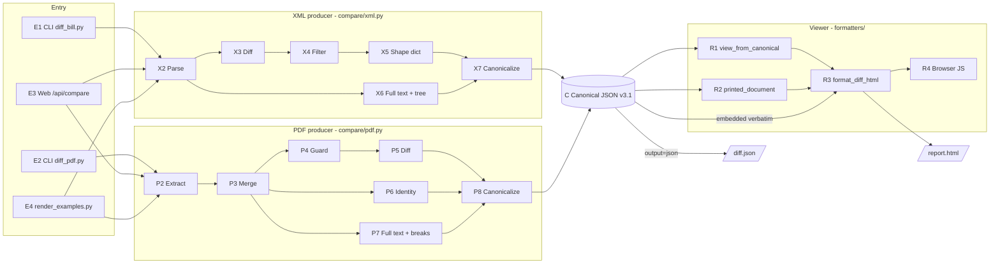
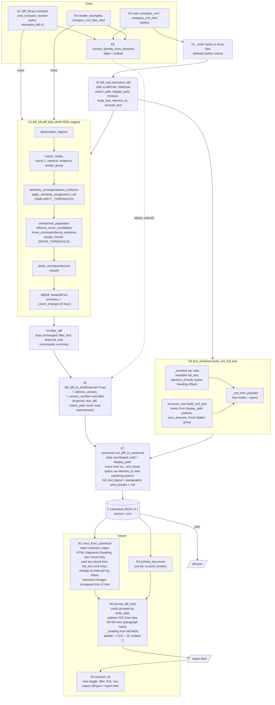
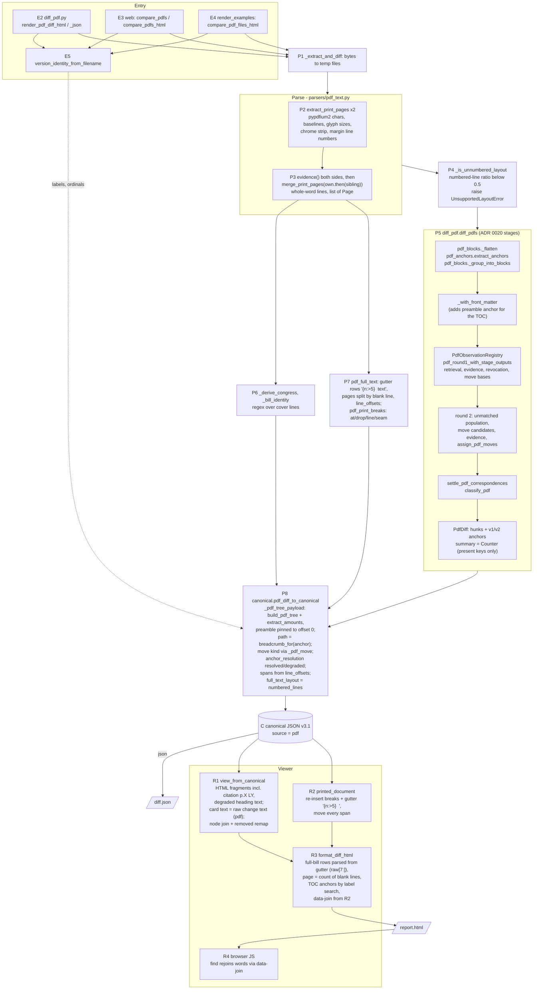
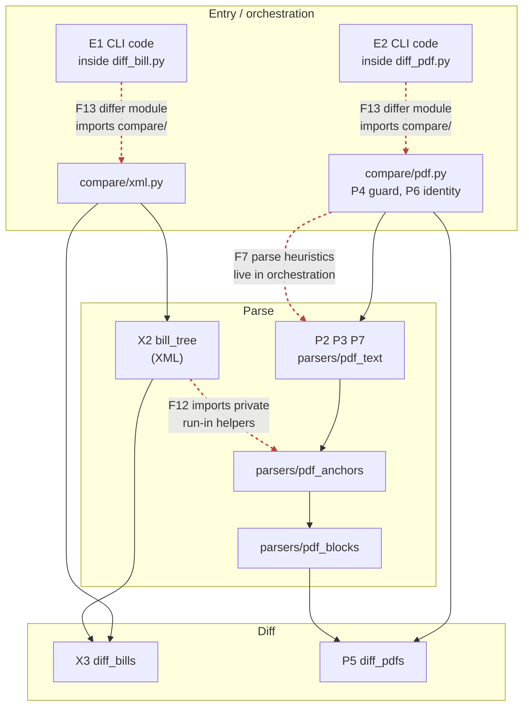
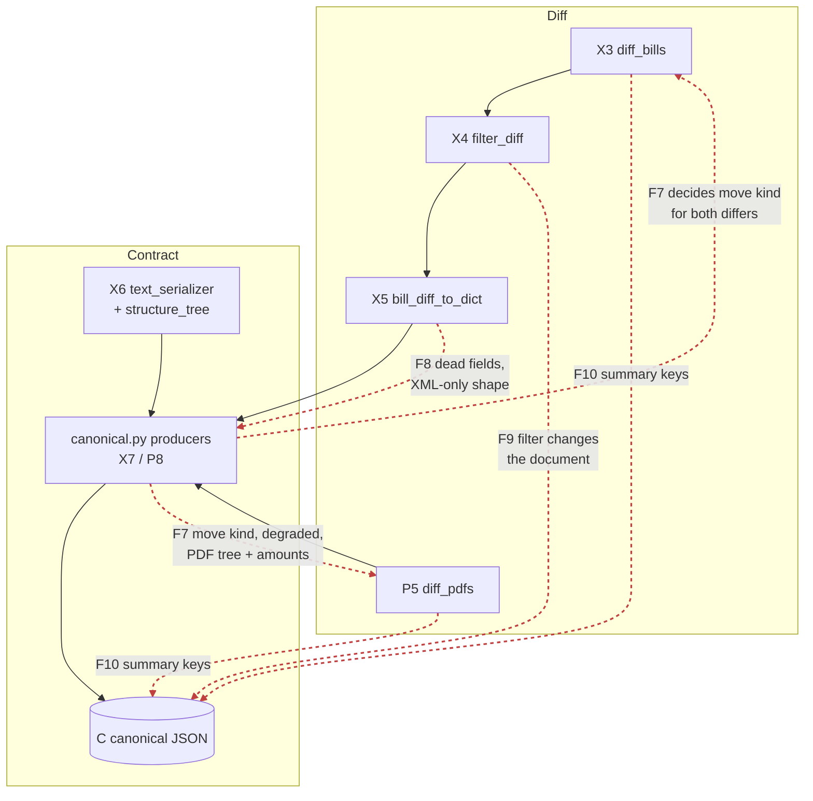
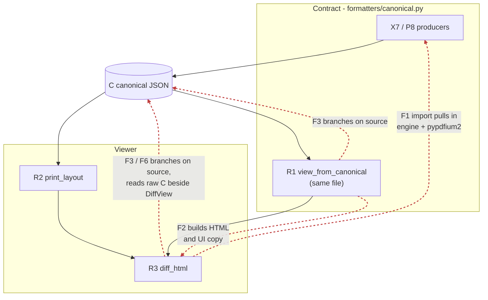
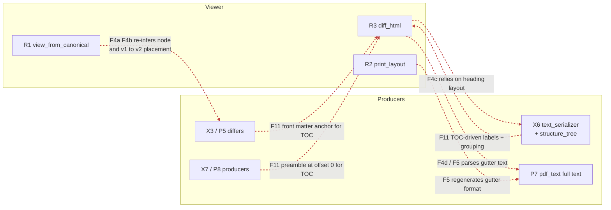

# Pipeline separation audit — scratch

Working notes for the parse → diff → contract → viewer separation refactor. Goal: each
stage can be changed by a different person without touching (or importing) another
stage. Not a published doc; findings graduate to issues/ADRs from here.

- **Started:** 2026-10-04
- **Baseline commit:** `f2e698a` (develop)
- **Status legend:** `open` · `issue filed` · `in progress` · `done` · `won't fix`

## Contents

1. [Stage IDs](#stage-ids)
2. [Overview](#overview-both-paths)
3. [XML pipeline, end to end](#xml-pipeline-end-to-end)
4. [PDF pipeline, end to end](#pdf-pipeline-end-to-end)
5. [Overlap map](#overlap-map) (per seam)
6. [Findings](#findings)
7. [Falsification pass](#falsification-pass) (round 1)
8. [Review round 2](#review-round-2)
9. [Work log](#work-log)
10. [Open questions](#open-questions)

---

## Stage IDs

Every finding below cites these IDs, so a finding can be located on the diagrams.

| ID | Stage | Owner (file:symbol) | Layer |
|---|---|---|---|
| **E1** | CLI entry (XML) | `diff_bill.py` → `deltatrack.diff_bill:cmd_compare` | entry |
| **E2** | CLI entry (PDF) | `diff_pdf.py` → `deltatrack.diff_pdf:main` → `render_pdf_diff_html` / `render_pdf_diff_json` | entry |
| **E3** | Web entry | `web/app.py:compare` (`POST /api/compare?format=&output=`) | entry |
| **E4** | Examples entry | `scripts/render_examples.py` → `compare_*_files_html` | entry |
| **E5** | Version identity | `version_stems:version_identity_from_filename` (label + ordinal) | entry |
| **X1** | Bytes → temp file | `compare/xml.py:_build` | orchestration |
| **X2** | Parse | `bill_tree:normalize_bill` → `BillTree` of `BillNode` | parse |
| **X3** | Diff | `diff_bill:diff_bills` → `BillDiff` (`NodeDiff`s + summary) | diff |
| **X4** | Filter | `diff_bill:filter_diff` (`--filter`, `--financial`) | diff (?) |
| **X5** | Shape | `diff_bill:bill_diff_to_dict(financial=True)` + label/ordinal overrides | diff → contract |
| **X6** | Full text + tree | `formatters/text_serializer:build_xml_full_text` → `structure_tree:build_xml_tree` | contract (in `formatters/`) |
| **X7** | Canonicalize | `formatters/canonical:xml_diff_to_canonical` | contract |
| **P1** | Bytes → temp file | `compare/pdf.py:_extract_and_diff` | orchestration |
| **P2** | Extract | `parsers/pdf_text:extract_print_pages` (pypdfium2) → `PrintPages` | parse |
| **P3** | Merge breaks | `PrintPages.evidence()` + `merge_print_pages` (own evidence, sibling fallback) → `list[Page]` | parse |
| **P4** | Layout guard | `compare/pdf.py:_is_unnumbered_layout` → `UnsupportedLayoutError` | orchestration (parse logic) |
| **P5** | Diff | `diff_pdf:diff_pdfs` → `PdfDiff` (hunks + anchors) | diff |
| **P6** | Doc identity | `compare/pdf.py:_derive_congress`, `_bill_identity` | orchestration (parse logic) |
| **P7** | Full text + offsets + breaks | `parsers/pdf_text:pdf_full_text`, `pdf_print_breaks` | parse |
| **P8** | Canonicalize | `formatters/canonical:pdf_diff_to_canonical` (+ `_pdf_tree_payload`) | contract |
| **C** | Canonical JSON | `schema/canonical-diff.schema.json` v3.1 — the contract | contract |
| **R1** | View model | `formatters/canonical:view_from_canonical` → `DiffView` | viewer (in contract module) |
| **R2** | Printed layout | `formatters/print_layout:printed_document` (applies `print_breaks`) | viewer |
| **R3** | HTML render | `formatters/diff_html:format_diff_html` | viewer |
| **R4** | Browser runtime | inline `_JS` in `diff_html.py` (filters, find, nav, export) | viewer |

---

## Overview (both paths)

Two producers, one contract, one renderer. `compare/` is the only place a report is
assembled (#42, #693).

---

## XML pipeline, end to end

Entry points converge on `compare/xml.py:_build_from_trees`. The web path enters with
bytes (`compare_xml[_html]` → `_build`, temp files); the CLI and examples parse first
and enter with `BillTree`s (`compare_xml_trees[_html]`, `compare_xml_files_html`).

---

## PDF pipeline, end to end

Entry points converge on `compare/pdf.py:_extract_and_diff` + `_build_canonical`. All
entries hand over bytes; CLI and examples read the file and pass bytes on.

---

## Overlap map

One diagram per seam. Solid black arrows are the intended flow. **Dashed red arrows are
a coupling across a stage boundary**, labelled with the finding (see [Findings](#findings)).
An arrow from A to B reads "A depends on, or decides something for, B".

### Seam A — Parse ↔ Diff ↔ Orchestration

### Seam B — Diff ↔ Contract

### Seam C1 — Contract ↔ Viewer

F1 is also drawn by placement: R1 sits inside the contract module.

### Seam C2 — Viewer reaching upstream, and producers shaped by the viewer

### Findings by stage boundary

| Boundary | Findings |
|---|---|
| Parse ↔ Parse (XML ↔ PDF) | F12 |
| Parse ↔ Orchestration | F7 (P4, P6) |
| Parse ↔ Viewer | F4c, F4d, F5 |
| Diff ↔ Contract | F7, F8, F9, F10 |
| Diff ↔ Viewer | F4a, F4b, F11 (P5 front matter) |
| Diff ↔ Entry/Orchestration | F13 |
| Contract ↔ Viewer | F1, F2, F3, F6, F11 |
| Viewer internal | F6, F14 |

---

## Findings

Ranked by impact on independent work. "Stages" uses the IDs above. Line numbers are
at the baseline commit.

### Summary

| # | Finding | Stages | Seam | Severity (was → now) | Verdict | Status |
|---|---|---|---|---|---|---|
| F1 | Contract producers and viewer input share one module; renderer imports the engine | X7, P8, R1, R3 | Contract ↔ Viewer | High → Med-High | **Holds**, low runtime cost | open |
| F2 | View model carries HTML and UI copy built in the contract module | R1 → R3 | Contract ↔ Viewer | High → Low | **Falsified** (ADR 0007 by design) | open |
| F3 | Viewer branches on `source` (pipeline identity) | R1, R3 | Contract ↔ Viewer | Medium → Low | **Mostly falsified**; rests on F5 | open |
| F4 | Viewer re-infers facts the contract omits | R1, R3 ← X3, X6, P5, P7 | Diff/Parse ↔ Viewer | High → High | **Split**: a narrowed, b **defect**, c holds, d falsified | open |
| F5 | Display gutter baked into PDF `full_text` | P7, R2, R3 | Parse ↔ Viewer | Med-High → Low | **Mostly falsified** (documented in schema) | open |
| F6 | Renderer reads two inputs (DiffView + raw document) | R1, R3 | Viewer internal | Low-Med → Low | **Partly falsified** | open |
| F7 | Meaning-level decisions made in the canonicalizer and orchestration | X7, P8, P4, P6 | Diff ↔ Contract | Med-High → Medium | **Split**: move kind + identity hold; rest falsified | open |
| F8 | XML-only intermediate dict with dead fields | X5 → X7 | Diff ↔ Contract | Medium → Medium | **Holds**, confirmed | open |
| F9 | Filters run before canonicalization and change the document | X4 | Diff ↔ Contract | Medium → Low-Med | **Holds**, CLI-only | open |
| F10 | `summary` shape differs per pipeline | X3, P5 → C | Diff ↔ Contract | Low-Med → Low-Med | **Holds**, confirmed | open |
| F11 | Structure tree spans every layer and is shaped by TOC needs | X6, P5, P8, R3 | Producer ↔ Viewer | Medium → Low | **Mostly falsified** | open |
| F12 | XML parser imports private PDF parser helpers | X2 ← pdf_anchors | Parse ↔ Parse | Medium → Low | **Partly falsified** (sharing is deliberate) | open |
| F13 | Differ modules host CLIs that import back up into `compare/` | E1, E2, X3, P5 | Diff ↔ Entry | Low-Med → Low | **Partly falsified** | open |
| F14 | Minor: structural filter in JS, duplicate bill-type vocab, web palette copy | R3, R4, P6, E3 | Misc | Low → nit | **Mostly falsified** | open |
| F15 | No import-direction gate for the pipeline layers | all | Enforcement | Medium → Medium | **Partly falsified** (3 gates exist) | open |
| F16 | Division display label decides structural level in the tree | X2 → X6 → C → R3 | Parse ↔ Contract | — → Medium | **New in round 2**, reproduced | open |
| F17 | XML `changes[].text` is the matcher's normalized body; view swaps text for XML only | X3 → C → R1 | Diff ↔ Contract | — → Low-Med | **New in round 2**, reproduced | open |

---

### F1 — Contract producers and viewer input share one module

> **Falsification verdict:** Holds. Viewer half uses no producer names; split is mechanical. Runtime cost ~0.2 s, no install cost. See [falsification pass](#falsification-pass).

- **Stages:** X7, P8 (producers) · R1 (consumer) · R3 (imports R1)
- **Where:**
  - `src/deltatrack/formatters/canonical.py:25-29` imports `diff_pdf`, `parsers.pdf_anchors`, `structure_tree`.
  - `canonical.py:463-805` is `view_from_canonical` and its helpers (the viewer side).
  - `src/deltatrack/formatters/diff_html.py:21` imports `view_from_canonical`.
- **Evidence:** importing `deltatrack.formatters.diff_html` loads `diff_pdf`, `bill_tree`,
  `matching`, `similarity`, `pdf_observations`, all of `parsers/`, `structure_tree` and
  `pypdfium2` (checked with `sys.modules` after import).
- **Why it matters:** a viewer developer cannot load the renderer without the full engine,
  and a contract change and a viewer change land in the same file and the same review.
- **Direction:** split into `contract/` (producers, `SCHEMA_VERSION`, major guard) and
  `view/` (`view_from_canonical`, join, remap). The renderer should depend on nothing but
  a `dict` that matches the schema.

### F2 — View model carries HTML and UI copy built in the contract module

> **Falsification verdict:** Falsified as a defect. ADR 0007 puts this display work in view building on purpose. See [falsification pass](#falsification-pass).

- **Stages:** R1 → R3
- **Where:** `canonical.py:466-536` (`_join_path`, `_format_range_str`, `_heading_and_nav`,
  `_citation_html`, `_move_info_html`); `formatters/view_model.py` fields `heading_html`,
  `nav_label_html`, `citation_html`, `move_info_html`.
- **Evidence:** CSS classes (`citation`, `move-info`, `v1`, `v2`) and user-facing wording
  ("anchor unresolved · see PDF for context", "— (new in v2)", "Renumbered:", "Moved:")
  are produced in `canonical.py`.
- **Why it matters:** UI wording and class names are edited in the contract module.
- **Direction:** `DiffView` carries raw fields (path parts, location ranges, move dict);
  all markup moves to the renderer.

### F3 — Viewer branches on `source`

> **Falsification verdict:** Mostly falsified. ADR 0007 allows source-specific work in R1; R3's check is the documented 3.0 shim. See [falsification pass](#falsification-pass).

- **Stages:** R1, R3 reading C
- **Where:** `canonical.py:490` (`_heading_and_nav`), `canonical.py:717` (`_card_texts`,
  slices `full_text` only when `source == "xml"`), `diff_html.py:529`
  (`_full_text_is_guttered` falls back to source for 3.0 documents).
- **Why it matters:** contradicts ADR 0007 and the `diff_html` docstring ("does not branch
  on which pipeline"). A PDF-side change can require a viewer edit.
- **Direction:** express the difference as data. `_card_texts`' PDF branch exists only
  because of F5; fixing F5 removes it. `degraded` is already a field and can drive the
  heading.

### F4 — Viewer re-infers facts the contract omits (ADR 0006 violation)

> **Falsification verdict:** 4a narrowed (9.4% XML unjoined) · 4b demonstrated defect (93 misfiled) · 4c holds (8,723 offsets dropped) · 4d falsified (0/6,130 mismatches). See [falsification pass](#falsification-pass).

ADR 0006: "A consumer may derive by applying facts the document carries; it may not
derive by re-inferring facts the document omits."

- **F4a — which tree node a change belongs to.** Stages R1 ← X3/P5.
  `canonical.py:547-617` (`_span_join_index`, `_join_node_path`) finds the node by
  interval-stabbing text offsets. The producer knows the answer (XML `element_id`, PDF
  anchor) and does not emit it.
- **F4b — where a removed change sits in v2.** Stages R1 ← X3/P5.
  `canonical.py:640` (`_remap_removed_path`) matches v1 breadcrumb labels to v2 tree
  labels (casefold, trailing-path overlap, level tiebreak, document order). That is a
  cross-version correspondence decision made in the view.
- **F4c — heading row offsets.** Stages R3 ← X6.
  `diff_html.py:268` (`_node_anchor_offset`) searches the full text for a line equal to the
  node label; depends on the serializer's heading-emission convention. X6 already computes
  heading offsets (`serialize_tree_for_tree`) and drops them.
- **F4d — line and page numbers.** Stages R3 ← P7.
  `diff_html.py:585-642` (`_parse_full_bill_lines`) slices the gutter (`raw[7:]`, line
  629) to recover line numbers, and derives page numbers by counting blank lines
  (`page += 1`, line 612). The "p. N" label is a count, not the printed `page_number`.
- **Direction:** add to C: tree node ids, a node reference per change (both sides), heading
  offsets, a per-side line table `(page_number, line_number, start, end)`. Schema bump.

### F5 — Display gutter baked into PDF `full_text`

> **Falsification verdict:** Mostly falsified. Format is specified in `schema/canonical-diff.md:180`; residual is string encoding. See [falsification pass](#falsification-pass).

- **Stages:** P7 → C → R2, R3
- **Where:** `parsers/pdf_text.py:808` (`_render_lines` emits `{n:>5}  text`),
  `formatters/print_layout.py:90` (re-emits `f"{line_number:>5}  "`),
  `diff_html.py:629` (strips 7 chars).
- **Why it matters:** three modules in three layers share an undocumented string format.
  Changing gutter width in the UI shifts every character offset in the contract. It is
  also why F3's `_card_texts` refuses to slice PDF text.
- **Direction:** `full_text` holds content only; line numbers move to the line table from
  F4d. The renderer draws the gutter.

### F6 — Renderer reads two inputs

> **Falsification verdict:** Partly falsified. Reading C directly is by design (ADR 0007); duplicate path rule remains. See [falsification pass](#falsification-pass).

- **Stages:** R1, R3
- **Where:** `format_diff_html` (`diff_html.py:921`) renders cards from `DiffView` but
  sidebar tree, full-bill view, heading and feature gates from the raw document.
  `_node_order_map` (`diff_html.py:178`) and `_v2_label_lookup` (`canonical.py:620`) each
  implement the same "hoist unlabeled nodes" path convention, and must agree for grouping
  to work.
- **Direction:** either `DiffView` becomes the complete view input, or the view model is
  dropped and the renderer reads C directly. Pick one. Put the path convention in one place.

### F7 — Meaning-level decisions made in the canonicalizer and orchestration

> **Falsification verdict:** Move-kind rules disagree on 85/161 PDF moves; identity placement holds; `anchor_resolution` falsified; amounts is duplication, not layer. See [falsification pass](#falsification-pass).

- **Stages:** X7, P8, P4, P6
- **Where:**
  - Move kind: `_xml_move` (`canonical.py:121`, from display paths) vs `_pdf_move`
    (`canonical.py:262`, from anchor text). Two rules, decided during serialization.
  - `anchor_resolution` degraded/resolved: `canonical.py:287-293`.
  - PDF tree + `own_amounts` (dollar extraction): `_pdf_tree_payload`,
    `canonical.py:336-397`. XML equivalent is in `structure_tree` via X6. Money computed in
    two different layers.
  - XML span fallback substring search: `_search_span`, `canonical.py:75`.
  - PDF layout guard and document identity: `compare/pdf.py:106`
    (`_is_unnumbered_layout`), `:158` (`_derive_congress`), `:214` (`_bill_identity`).
    XML gets identity from its parser.
- **Why it matters:** the risk map ranks financial diff and the contract as top risks; both
  have logic sitting in serialization and orchestration code instead of their owners.
- **Direction:** move kind and anchor resolution become differ output (`NodeDiff`,
  `PdfHunk`); PDF tree/amounts move beside the XML tree builder; identity and layout
  guard move into `parsers/`.

### F8 — XML-only intermediate dict with dead fields

> **Falsification verdict:** Confirmed. Canonical identical without the fields on 27/27 pairs; 6,720 financial entries discarded. See [falsification pass](#falsification-pass).

- **Stages:** X5 → X7
- **Where:** `compare/xml.py:69` calls `bill_diff_to_dict(result, financial=True)`;
  `diff_bill.py:1852-1895`.
- **Evidence:** nothing in `formatters/canonical.py` reads `financial`,
  `financial_summary`, `text_diff` or `match_path`. `PdfHunk.has_amendment_annotations`
  (`diff_pdf.py:102`) also never reaches C. Since #693, the `--financial` multiset facts
  that ADR 0006 calls "untouched" reach no output.
- **Why it matters:** wasted work, and the two producers start from different input shapes
  (dict vs typed `PdfDiff`), so the conversion code can't be shared or symmetric.
- **Direction:** `xml_diff_to_canonical` takes `BillDiff` directly, like the PDF side takes
  `PdfDiff`. Decide what happens to the financial facts (into C, or deleted).

### F9 — Filters run before canonicalization and change the document

> **Falsification verdict:** Confirmed on 25/27 pairs; CLI-only, so lower severity. See [falsification pass](#falsification-pass).

- **Stages:** X4 (between X3 and X5)
- **Where:** `compare/xml.py:64` (`filter_diff(filter_text, financial_only)`),
  `diff_bill.py:1898`.
- **Why it matters:** a filtered document looks exactly like a full one (summary
  recomputed, no record of the filter). XML only; PDF has no filter. ADR 0006: variants
  are produced downstream of the document, not upstream.
- **Direction:** always build the full document; filter as a consumer step (or record the
  filter in the document).

### F10 — `summary` shape differs per pipeline

> **Falsification verdict:** Confirmed. XML: one 5-key set on 27/27; PDF: 7 different key sets across 17 pairs. See [falsification pass](#falsification-pass).

- **Stages:** X3, P5 → C
- **Where:** XML `_count_changes` (`diff_bill.py:1794`) always emits five keys including
  `unchanged`; PDF `PdfDiff.summary` (`diff_pdf.py:112`) emits only types that occur.
  Schema permits any integer-valued keys.
- **Direction:** the producer side computes `summary` from the final `changes` with a fixed
  key set; tighten the schema.

### F11 — Structure tree spans every layer and is shaped by TOC needs

> **Falsification verdict:** Mostly falsified. Structural choices are the producer's; residual is `""` label used as a hide flag. See [falsification pass](#falsification-pass).

- **Stages:** X6, P5, P8 → R3
- **Where:**
  - `structure_tree.py` imports both `bill_tree` and `parsers.pdf_anchors`; XML tree built
    in `formatters/text_serializer.py`, PDF tree in `formatters/canonical.py`.
  - `structure_tree.py:68-86` picks display labels so a group "renders as a navigable
    toggle"; `:214` front-matter grouping justified by TOC appearance.
  - `parsers/pdf_blocks.py:181` `_with_front_matter` exists "to keep the section TOC
    complete".
  - `canonical.py:357-369` pins the preamble to offset 0 so it "renders as a navigable
    entry (#161)".
- **Why it matters:** TOC changes require edits in parser, differ and producer code.
- **Direction:** the tree describes the bill; the TOC's display rules (hide unlabeled,
  collapse, front-matter grouping) live in the renderer.

### F12 — XML parser imports private PDF parser helpers

> **Falsification verdict:** Partly falsified. Sharing is required for label parity; only the private placement remains. See [falsification pass](#falsification-pass).

- **Stages:** X2 ← pdf_anchors
- **Where:** `bill_tree.py:8` imports `_RUNIN_QUOTED_LINE`, `_match_runin_subsection` from
  `parsers/pdf_anchors`.
- **Why it matters:** an edit to the PDF parser can silently change XML parse output (and
  the XML parser revision, ADR 0019).
- **Direction:** move the shared run-in matching to a neutral module both parsers import.
- **Related:** `diff_pdf.py:58-64` imports private `_Block`, `_flatten`,
  `_group_into_blocks`, `_with_front_matter` from `pdf_blocks`. Within one pipeline, so
  lower priority, but the names say "private".

### F13 — Differ modules host CLIs that import back up

> **Falsification verdict:** Partly falsified. `python -m` entry is documented; the upward import is function-local. See [falsification pass](#falsification-pass).

- **Stages:** E1, E2 inside X3, P5
- **Where:** `diff_bill.py:1934-2217` (argparse, version listing, path resolution,
  `cmd_compare`); `diff_pdf.py:1314-1400`. Both lazy-import `compare.*` "to avoid a
  circular import".
- **Direction:** move CLIs to a `cli/` module (or the root wrappers); differ modules stop
  importing `compare/`.

### F14 — Minor

> **Falsification verdict:** Structural filter falsified (applies carried `change_type`); designator nit stands. See [falsification pass](#falsification-pass).

- "Structural" filter defined in the report JS as `type !== 'modified'`
  (`diff_html.py:391, 1380`): a classification rule lives in UI code. (R4)
- Bill-type vocabulary twice: `_DESIGNATORS` (`diff_html.py:450`) and `_BILL_DESIGNATOR`
  regex (`compare/pdf.py`). (R3, P6)
- Web app CSS has its own palette copy (`web/webapp/css/styles.css`, `compare.js`); already
  noted in `palette.py` docstring. (E3)

### F15 — No import-direction gate for the pipeline layers

> **Falsification verdict:** Partly falsified. Three gates exist; viewer, XML parser and differ→compare directions are unguarded. See [falsification pass](#falsification-pass).

- **Stages:** all
- **Where:** `tests/test_surface_boundary.py` gates product vs `tools/`/`web/`;
  `tests/test_formatter_boundary.py` gates one constant. Nothing asserts
  parse → diff → contract → viewer direction.
- **Direction:** an AST import-graph test in the style of `test_surface_boundary.py`,
  with an allowlist of today's violations that shrinks as findings close.

---

## Falsification pass

**2026-10-04, baseline `f2e698a`.** Each finding was treated as a hypothesis and attacked
three ways:

1. **Run it.** Run the real pipeline over the committed corpus and measure the claim.
2. **Is it sanctioned?** Look for an ADR, schema text or docstring that makes the
   behaviour a deliberate decision rather than drift.
3. **Is it already guarded?** Look for a test that already catches it.

A finding survives only if all three fail to knock it down.

**Corpus.**
- XML: every adjacent committed pair under `tests/corpus/` (27 pairs, 17,873 changes).
- PDF: every adjacent committed pair (23), run through the production merge flow
  (`cached_print_pages` → sibling-evidence merge → `diff_pdfs` → `_build_canonical`).
  6 were declined as unnumbered prints, leaving 17 pairs and 6,371 changes.
- Experiment scripts are in the session scratchpad (`falsify_xml*.py`, `falsify_pdf.py`,
  `f4c.py`). They are not committed. Ask if they should be.

### Scoreboard

| Verdict | Findings |
|---|---|
| Holds, confirmed or strengthened | F1, F4b (now a demonstrated defect), F4c, F8, F10 |
| Holds, narrowed | F4a, F7 (move kind, identity), F9, F15 |
| Mostly or partly falsified | F3, F5, F6, F11, F12, F13, F14 |
| Falsified | F2, F4d, F7 (`anchor_resolution`) |

### Evidence per finding

**F1 — holds; practical cost lower than stated.**
- The viewer half of `canonical.py` (`view_from_canonical` and its helpers) uses **none**
  of the producer-side names (AST check): no `PdfDiff`, `PdfHunk`, `Anchor`,
  `breadcrumb_for`, `build_pdf_tree`, `TreeNode` or `extract_amounts`. The split is
  mechanical.
- The `diff_pdf` import is annotation-only, but `breadcrumb_for` and `build_pdf_tree` are
  runtime calls, so `pdf_anchors` → `pdf_text` → `pypdfium2` still loads.
- Attack that partly landed: everything ships as one installed package, so a viewer
  developer loses nothing at install time. Importing the renderer costs ~0.2 s, of which
  `diff_pdf` is 0.16 s (`-X importtime`).
- What survives is ownership and review coupling, plus the transitive closure. Severity
  High → Med-High.

**F2 — falsified as a defect.**
- ADR 0007 §Decision: "Pipeline-specific display work (citation blocks, move-info,
  breadcrumbs, heading construction) is done when building the view from the canonical
  document, not in the renderer."
- None of the HTML reaches C; it lives in `DiffView`, which is viewer-side.
- This only matters if R1 and R3 get different owners. Revisit after the F1 split.

**F3 — mostly falsified; what remains is caused by F5.**
- ADR 0007 permits source-specific work in view building (R1). Its standing policy pushes
  presentational differences "up into the canonical document or the view it builds".
- The renderer-level check (`_full_text_is_guttered`) reads `full_text_layout`. It falls
  back to `source` only for 3.0 documents, exactly as `schema/canonical-diff.md:183`
  prescribes.
- `_heading_and_nav`: the XML branch and the PDF branch give identical output for 17,826
  of 17,873 XML changes. The 47 differences are path-less changes (`"(unknown)"` vs
  `""`). The branch is near-redundant, not harmful.
- `_card_texts`: the XML-only slice is *justified*. Slicing PDF `full_text` by change span
  would drag the gutter into **846 of 864** two-sided PDF cards. The branch exists because
  of F5.

**F4a — narrowed.**
- Joining a change to a tree node by span containment *applies* facts the document
  carries (both spans are in C). ADR 0006 allows that, so the "re-infers" label was too
  strong.
- But it fails on facts the document has in another form:
  - XML: **1,676 of 17,873 changes (9.4%)** go unjoined (1,548 added, 128 removed). All
    have a null span (bodyless nodes), yet each carries a `path` locating it. They fall
    back to the flat group.
  - PDF: 51 of 6,371 (0.8%), all with null spans.

**F4b — holds, upgraded to a demonstrated defect.**
- XML: 711 removed changes, of which 364 are remapped to a structurally different path.
  **93** of those land outside the deepest v1 ancestor that still exists in v2, and **48**
  land under a different top-level group.
- Example, `114-hr-2029` 1→3: removed `TITLE I—Department of defense > Administrative
  provisions > sec. 122 > (a)` is filed under `TITLE II—Department of veterans affairs >
  … > sec. 227 > (a)`, although `sec. 122` still exists in v2.
- Cause: the deepest-segment-first label match lets generic labels such as `(a)` match
  anywhere.
- PDF: 155 structural remaps. The surviving-ancestor misfile was not measured on PDF.
- Queued as a separate fix task. This is the clearest case of the viewer doing a
  correspondence decision badly.

**F4c — holds, strengthened.**
- XML: the label search decides **9,717 of 34,715** v2 tree-node anchors (28%).
- For **8,723** content nodes the producer already holds the exact heading offset (in
  `serialize_tree_for_tree`'s heading-offset map; the line equals the label in 100% of
  cases) and emits the body span instead.
- PDF: the search never succeeds. All 8,719 spanned nodes take the fallback, because the
  printed line starts with the gutter. The fallback lands on the anchor line, which is
  correct. So in practice the heuristic is XML-only.

**F4d — falsified.**
- The `numbered_lines` layout is specified in the contract: "An empty row separates one
  page from the next; pages count from 1" (`schema/canonical-diff.md:180`). Counting
  blank rows applies a documented rule.
- `Page.page_number` equals the physical index on 17 of 17 pairs.
- 0 of 6,130 placed PDF changes sit under a `p. N` header different from their
  `location.v2.start_page`.

**F5 — mostly falsified.**
- The gutter format is part of the contract (`schema/canonical-diff.md:180`), and
  `print_breaks` reuses it by definition. `print_layout` regenerates it per spec, so this
  is not an undocumented three-module protocol.
- ADR 0007 / #95 already plans paragraph flow as the default with the gutter as an opt-in
  view.
- Residual: line numbers are string-encoded inside `full_text`, so changing gutter width
  is a schema major. That encoding is what forces F3's `_card_texts` branch.

**F6 — partly falsified.**
- ADR 0007 says the renderer is "driven only by the canonical JSON", so reading C
  directly is by design.
- The duplicated "hoist unlabeled nodes" path rule (`_node_order_map` /
  `_v2_label_lookup`) remains. Its outcome is guarded by
  `tests/test_diff_html_node_groups.py:179`.

**F7 — split.**
- **Move kind: holds.** Applying the XML rule (same parent, last label differs →
  renumbered) to PDF moves gives a different kind on **85 of 161** (53%). Example: `FOR
  CIVIL WORKS` → `CIVIL WORKS` under a different parent is `renumbered` on PDF and would
  be `relocated` on XML.
  - Attack that landed: the PDF anchor text equals the last path element on 161 of 161
    moves. Both rules can be computed from what C already carries, so the issue is **two
    rules**, not which layer owns them.
- **`anchor_resolution`: falsified.** It is computed purely from `path` and `location`,
  both carried in C, so it is a convenience field and not a decision hidden in the wrong
  layer.
- **`own_amounts`: narrowed.** Both trees are built in contract-layer code (XML in
  `structure_tree` via the parser's `amount_text`, PDF in `canonical.py` via block
  offsets). The issue is two implementations of one money observation, not the layer.
- **P4 / P6 identity and layout guard: holds.** XML identity comes from the parser
  (`BillTree`); the PDF regexes live in `compare/pdf.py`.
- Severity Med-High → Medium.

**F8 — holds, confirmed.**
- The canonical document is equal (dict equality) with and without `financial`,
  `text_diff` and `match_path` on **27 of 27** pairs.
- **6,720** financial entries are computed and discarded, and 0 occurrences reach C.
- ADR 0006 still says the `--financial` multiset facts are "untouched". They reach no
  output since #693, so the ADR text is stale.

**F9 — holds, narrowed.**
- `filter_text="title"` changed `summary` on **25 of 27** pairs. Nothing in the document
  records the filter.
- Only the CLI exposes filters (the web endpoint does not). Medium → Low-Med.

**F10 — holds, confirmed.**
- XML: one key set, `added, modified, moved, removed, unchanged`, on 27 of 27 pairs.
- PDF: **7 different key sets** across 17 pairs (for example `modified` alone, or
  `added, removed`), and never `unchanged`.

**F11 — mostly falsified.**
- Deciding that front matter is a group, and choosing node labels, are structural claims
  the producer legitimately owns. The preamble anchor is also used for hunk attribution in
  `_group_into_blocks`, not only for the TOC. "TOC" in the comments is motivation, not
  coupling.
- Residual: an empty label `""` doubles as a hide-from-TOC instruction
  (`structure_tree.py:68-86`, `diff_html.py:334`).

**F12 — partly falsified.**
- The sharing is deliberate. `bill_tree._subsection_label` (`:446-455`) uses the PDF
  run-in matcher "so both pipelines derive the same label from the same `.—` signal".
- `tests/test_xml_subsection_nodes.py` checks XML labels against PDF recall, so drift
  between the two is caught.
- Residual: a rule both parsers depend on lives as a private name inside one of them.

**F13 — partly falsified.**
- `python -m deltatrack.diff_bill` is a documented entry point (`README.md:64`).
- The import back up into `compare/` is function-local, so the module-load import graph
  is clean.
- Residual: CLI code and differ code share a file.

**F14 — mostly falsified.**
- The "Structural" filter reads only the carried `change_type`, which ADR 0006 explicitly
  allows a consumer to do.
- The palette copy is already acknowledged in `palette.py`.
- Nit that stands: the bill-type vocabulary is written twice, as parse regex and display
  map (`compare/pdf.py`, `diff_html.py:450`).

**F15 — partly falsified.**
- Three direction gates exist:
  - product ↛ `tools/`/`web/` (`tests/test_surface_boundary.py`)
  - PDF parser closure ↛ matcher and thresholds
    (`tests/test_pdf_observation_identity.py:203`)
  - formatters ↛ `SIMILARITY_THRESHOLD` (`tests/test_formatter_boundary.py:125`)
- The last one checks *direct* references only. `canonical.py` reaches `similarity`
  transitively via `diff_pdf`.
- Still unguarded: viewer → producers and parsers; the XML parser; differ → `compare/`.

### What changed in the overall picture

- The strongest remaining items are **F1** (mechanical split, unblocks teams), **F4b**
  (a real misfiling bug from the view doing correspondence work), **F4c** (the producer
  drops a fact the viewer then searches for), **F7** move kind (two rules for one field),
  **F8** (dead work plus a stale ADR statement), **F10**, and the unguarded directions in
  **F15**.
- Several findings were really disagreements with decisions the team already recorded
  (ADR 0006, ADR 0007, the schema's `numbered_lines` spec). They are reclassified rather
  than kept as defects. Reopening them would be an ADR change, not a cleanup.

---

## Review round 2

**2026-10-04, baseline `f2e698a`.** Five independent reviewers ran with fresh context. None
saw round 1's evidence or verdicts; each had to reproduce or break the claims with its own
code.

| Reviewer | Brief |
|---|---|
| **A** | Try to break F1, F13, F15. |
| **B** | Try to break F4a, F4b, F4c. |
| **C** | Try to break F7, F8, F9, F10. |
| **D** | Try to *revive* the findings round 1 dismissed: F2, F3, F4d, F5, F11, F12, F14. |
| **E** | Blind audit. Never read this file; found overlaps independently. |

I re-ran every new finding, every verdict change and the one reviewer conflict myself
(`round2/spot*.py` in the session scratchpad): F7's flip counts, F9's filter case, F12's
17 keys, F16, F17, and F4c (B vs E). All reproduced exactly. The other numbers below are
the reviewer's own measurement: F1's simulated split, F15's planted violations, F4b's PDF
counts and examples, and C's identity and timing figures. Where round 1 measured the same
quantity, the two agree.

### Convergence check

| Finding | Round 1 | Round 2 | Changed? |
|---|---|---|---|
| F1 split producers / viewer | Holds | Holds, weakened (A); found independently (E #3) | Evidence corrected |
| F4a node join misses | Narrowed | Holds (B); fix direction corrected | Evidence corrected |
| F4b removed-change misfile | Defect | Defect, strengthened on PDF (B); found independently (E #1) | Example corrected, PDF added |
| F4c TOC label search | Holds | Holds, "producer knows" weakened (B); found independently (E #6) | Evidence corrected |
| F7 move kind | Holds | **Strengthened** (C) | Yes |
| F7 PDF identity | Holds | Holds, more evidence (C); found independently (E minor) | No |
| F8 dead financial work | Holds | Holds (C); ADR staleness only half true | Narrowed |
| F9 filters before contract | Holds | Holds; documented and tested (C); filter keys on match keys (E #5) | Narrowed + new angle |
| F10 summary shape | Holds | Holds, cosmetic (C) | No |
| F12 XML parser → PDF helpers | Partly falsified | Found independently as a blocker (E #7): 17 XML match keys move | **Revived (partly)** |
| F13 CLI in differ | Partly falsified | Holds as tracked debt (A): ADR 0017, #62 | No (context added) |
| F15 no direction gate | Partly falsified | Holds (A): 4 planted violations pass every gate | Evidence strengthened |
| F2, F3, F4d, F5, F11, F14 | Falsified / mostly | *Review D pending* | — |
| **F16** division label decides tree level | — | **New** (E #2), reproduced | New |
| **F17** XML `text` is the matcher's normalized body | — | **New** (E #4) | New |

**Not converged.** Round 2 produced two new findings, one verdict upgrade (F7) and one
partial revival (F12), and corrected four pieces of round 1's evidence. A round 3 is needed.

### Corrections to round 1 (things round 1 got wrong)

1. **F4b example pair.** The `114-hr-2029` case is in pair **4→5** (`4_reported-in-senate →
   5_engrossed-amendment-senate`, change `c-0046`), not 1→3. Pair 1→3 has no misfiled
   removal. The fix-task card queued in round 1 carried the wrong pair; it was dismissed.
2. **F1 "the viewer half uses no producer names" is false.** `_reject_unknown_major` uses
   `SCHEMA_VERSION`. The split still works, but the reader needs its own supported-major
   constant or a tiny shared module. Round 1's AST check only looked for a fixed list of
   names.
3. **F4c "the producer already knows the heading offset" is overstated.**
   `serialize_tree_for_tree`'s heading-offset map keeps the **first** occurrence per
   `display_path`. For 63 nodes in the pair v2 trees (75 across all 58 versions) that is
   the wrong, earlier heading, so emitting the map as-is would make those anchors worse.
   The per-node offset exists inside the walk (`heading_markers`), not in what it exposes.
   Round 1's "line equals the label in 100%" check could not see this, because a duplicate
   heading also equals the label. The count is 9,722 content nodes on the pair v2 trees;
   round 1's 8,723 used a different population.
4. **F4a fix direction was wrong.** The unjoined nodes' `element_id` spans are
   zero-length, and the join deliberately drops zero-length spans
   (`canonical.py:576`). Simulating the join with them still fails 1,672 of 1,675. The fix
   needs a node reference on the change, or a non-empty span such as the `SEC.` line.
5. **F15 missed a gate.** `tests/test_matching_contracts.py:552` asserts that
   `deltatrack.matching` imports nothing from `deltatrack`.
6. **F8 "ADR 0006 is stale" was half right.** The `--filter` / `--financial` flags still
   exist and decide on `amounts_changed`. Only the clause saying the multiset facts reach
   output is stale. The post-#693 behaviour is documented in `README.md:178` and pinned
   by `test_financial_diff.py::test_the_flag_adds_no_money_to_the_document`.
7. **F9 is documented, deliberate behaviour.** `README.md:178` says the output keeps its
   shape and `summary` counts what remains; `tests/test_diff_bill.py:923` pins the
   all-zero summary for a filter that matches nothing.

### What strengthened

**F7 move kind (C, spot-checked).**
- The two rules disagree in **both** directions. The PDF rule applied to XML moves flips
  **167 of 496** (34%) from `relocated` to `renumbered`; 164 of those have section-number
  labels. The XML rule applied to PDF moves flips 85 of 161. Both reproduce exactly.
- They disagree exactly when the parent and the last label both change. The schema's two
  kinds don't cover that case. Read literally (`schema/canonical-diff.md:448-451`), it
  favours the PDF rule.
- The PDF rule is plainly wrong on headings. 23 of its 153 `renumbered` moves involve
  account or heading labels: line-wrap fragments (`FOR CIVIL WORKS` → `CIVIL WORKS`) and
  different accounts (`ELECTRICITY DELIVERY` → `NUCLEAR ENERGY`, 115-hr-5895 3→4). These
  render as "Renumbered:".
- `_xml_move`'s docstring says it is "mirroring `_pdf_move` (#188)" (`canonical.py:122`).
  It does not.
- No test covers "parent and label both changed"
  (`tests/test_formatters_canonical.py:132-165`).

**F4b (B, E, round-1 numbers reproduced).**
- PDF misfiles too: 26 of 190 joined removals, **24 under a different top-level title or
  division**.
- B walked the rendered HTML: `c-0046` sits inside TITLE II's `
` in both the cards
  and the sidebar.
- E found more examples independently. In 115-hr-5895 2→4, `c-0013` (`… > sec. 101 >
  (b)`) is filed under `Sec. 3 > (b)`.
- `schema/canonical-diff.md:242` says the tree is per-side, "not paired — cross-version
  node pairing remains the diff engine's job". The view is doing exactly that.
- No test guards it. `test_xml_removed_changes_place_into_v2_groups` only asserts a
  non-empty `node_path`, and the unit tests use unique labels.

**F15 (A).** A copy of the repo with four planted layering violations passed every
boundary gate (228 passed):
1. `diff_html` → `diff_bill`
2. `bill_tree` → `similarity`, and `bill_tree` → `compare.xml`
3. `diff_bill` → `formatters.diff_html`
4. `structure_tree` → `diff_pdf`

**F1 (A).**
- A simulated split (the viewer half plus `SCHEMA_VERSION` in a standalone module)
  renders **byte-identical** reports for 115-hr-5895 1→2, both XML and PDF.
- Renderer import drops to ~34 ms with no `pypdfium2`, and no other import route pulls the
  engine back in.
- Friction to plan for:
  - `tests/test_canonical_node_join.py:349-353` monkeypatches `canonical._span_join_index`.
  - Five test files import `view_from_canonical` from `canonical`.
  - A frozen research probe imports `_move_info_html` from `canonical`, and
    `test_research_probes.py` turns red without a re-export.
- Already tracked: open issue #62 lists `canonical.py` → `diff_pdf` as the main obstacle to
  packaging the engine cleanly.
- Separately, the `diff_pdf` edge could go under `TYPE_CHECKING` today, since `PdfDiff`
  and `PdfHunk` are annotation-only.

**F12 (E, partly revives the round-1 dismissal).** Disabling the PDF run-in matcher changes
**17 XML `match_path` keys** across 3 bills. So tuning PDF anchors changes the XML diff, and
only the byte-identity baselines would notice. The sharing is still deliberate; what's
revived is that it blocks independent work in practice, not just in principle.

### New findings

**F16 — A division's display label decides its structural level in the tree.** *(E #2;
reproduced.)*
- Stages: X2 (display label) → X6 (`structure_tree`) → C (`tree[].level`) → R3
  (navigation and grouping).
- `structure_tree.py:58, 88-93` assigns `division` / `title` by regex over label text, and
  `_group_front_matter` (`:233`) keys on those levels.
- Rendering division labels in GPO form (`DIVISION A—…`, the #66 direction) on 118-hr-4366
  5→6 leaves every change identical. But the v2 root goes from `{division: 7, preamble: 1}`
  to `{heading: 7, section: 6, preamble: 1}`: the division level is lost and six
  front-matter sections spill to the root.
- This contradicts the recorded separation. `bill_tree.py:13-21` and `:563-570`,
  `pdf_anchors.py:35-40` and `architecture.md:171-175` all say the division label is
  display-only. That separation was built for match keys (#468), not for the tree.
- Fix direction: carry a typed level from the parser (the `Division` object, the anchor's
  kind) into `TreeNode`; stop regex-matching labels.

**F17 — XML `changes[].text` carries the matcher's normalized body; the view swaps in
readable text for XML only.** *(E #4; consistent with the `_card_texts` docstring.)*
- Stages: X3 (match normalization) → C → R1.
- `diff_bill.py:1048-1049`: `old_text` / `new_text` "stay body_text — they feed matching,
  text_diff and the JSON payload". `_card_texts` (`canonical.py:697-731`) slices readable
  `full_text` instead, for XML only.
- The card and the exported `diff.json` disagree on 439 of 1,377 text sides (117-hr-4502),
  220 of 553 (115-hr-5895) and 728 of 766 (119-hr-1). The differences are whitespace only
  (`(a)Of` vs `(a) Of`), but they are different tokens to anything word-diffing the JSON.
- The same leak shows in `path`. In-title sections carry the lowercased match form
  `sec. 101` (`bill_tree.py:910`, `_build_paths:662-664`), while body-level sections carry
  `Sec. 3`.
- This reframes part of F3. The source branch in `_card_texts` exists to undo a matcher
  representation leaking into the contract, not only because of the PDF gutter.
- Recorded as a workaround (#76). Fix direction: the producer emits readable text in
  `text` and keeps `body_text` internal.

**F9, new angle — the CLI filter keys on internal match keys.** *(E #5; reproduced.)*
`--filter "TITLE II"` on 118-hr-4366 1→2 returns **0 changes**, while 13 change
breadcrumbs contain "TITLE II". `filter_diff` matches against `match_path`, which drops the
title enum and division (`diff_bill.py:1898-1920`). The help text concedes the division
part. A change to match keys silently changes filter results.

### Context added, no verdict change

- **F7 identity (C).**
  - Across 17 PDF pairs, `congress` is `""` in 6, the title is a lowercase fragment in 5,
    and the title is missing in all 3 pairs of 113-hr-3547.
  - `_bill_identity` has no unit test.
  - XML takes type, number and congress from the **old** tree but the title from the
    **new** one; PDF reads everything from the new version.
  - `congress` is a string on PDF and an integer on XML.
- **F8 (C).** Canonical output is SHA-256 identical with the fields dropped *or replaced by
  junk*, on 27 of 27 pairs. The wasted financial work is 0.90 s of 9.66 s total XML compare
  time (~9%).
- **F10 (C).** No consumer is affected (`_summary_bar_html` uses `.get(k, 0)`; no JS reads
  `summary`). But `unchanged` is outside the schema's `change_type` enum, which the prose
  says summary keys are drawn from.
- **F13 (A).**
  - Recorded debt in ADR 0017 (lines 33-38) and issue #62.
  - `filter_diff` sits under the `# --- CLI ---` header but is library code used by
    `compare/xml.py`.
  - The `src/deltatrack/__init__.py` docstring and #62's body describe a cycle that no
    longer exists.
  - The real cycles:
    - `compare.xml` → `diff_bill` ⇢ `compare.xml`
    - `compare.pdf` → `canonical` → `diff_pdf` ⇢ `compare.pdf`
    - `diff_html` → `canonical` → `diff_pdf` ⇢ `compare.pdf` → `diff_html`
- **F4a (B).**
  - 1,675 of the 1,676 unjoined null-span changes are #188 empty-body sections.
  - 1,622 of them cause the same top-level heading to render twice: the flat fallback
    group repeats a tree group's label.
  - `test_xml_join_matches_structural_path` skips exactly this class (fail-open).
- **F4c (B, E).**
  - The search never picks a wrong heading: all 15,313 search decisions across the 58 XML
    versions were checked against an independent re-walk of the serializer.
  - E flagged 21 anchors on 118-hr-4366 v6 that land 200+ lines above their span. I checked
    the top cases. They are content nodes labelled with their parent title's name (for
    example a headerless "may be cited as" section), and the search correctly lands on
    that title heading. The quirk is duplicate labels in the tree, not a wrong anchor.
  - One real but tiny flaw: "Receipts collected" (Export-Import Bank) has a body that
    starts with its own label, so the own-line check anchors 20 characters below the real
    heading. One node per affected version, 9 of 58 versions.

---

## Work log

| Date | What | Findings touched |
|---|---|---|
| 2026-10-04 | Initial audit; diagrams; findings F1–F15 recorded. No code changes. | all |
| 2026-10-04 | Falsification pass over 27 XML + 17 PDF corpus pairs; verdicts and revised severities recorded; F4b misfiling queued as a separate fix task. No code changes. | all |
| 2026-10-04 | Review round 2: five independent reviewers (A–E, E blind); new F16, F17; F7 strengthened; F12 partly revived; seven round-1 corrections. Not converged. No code changes. | all |

## Open questions

- **Convergence criterion** for these review rounds: a round in which (1) no verdict changes, (2) a blind audit finds nothing outside the list, and (3) no evidence correction beyond wording.

- F2/F3/F5 were reclassified as recorded decisions (ADR 0006/0007, schema). Does the team want any of them reopened as ADR changes?
- F4b: fix narrowly in the view (prefix match), or move v1→v2 container correspondence into the producer?
- Keep `DiffView` as the viewer's single input, or drop it and render from C directly? (F6)
- Should `--financial` facts be in the contract, or deleted? ADR 0006 still describes them as available. (F8)
- Is the F4 fix one schema minor (additive fields) or does removing the gutter (F5) force a major?
- Which order: the import gate (F15) first with an allowlist, or F1 split first?
