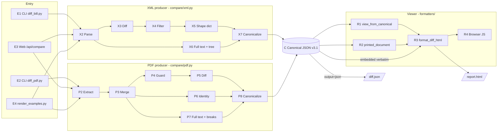
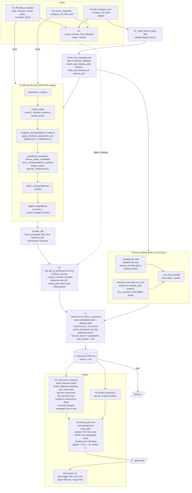
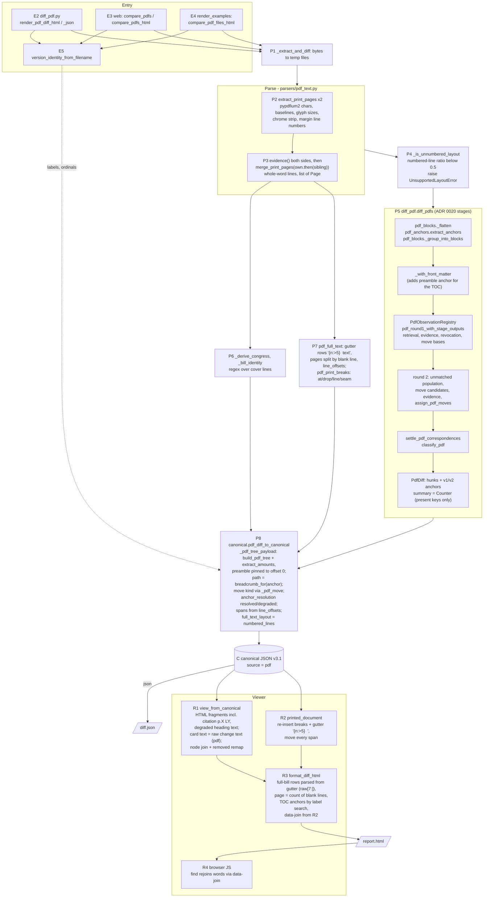
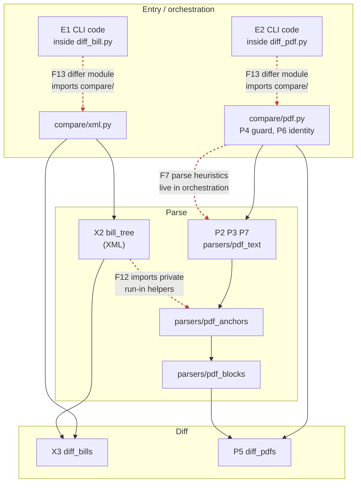
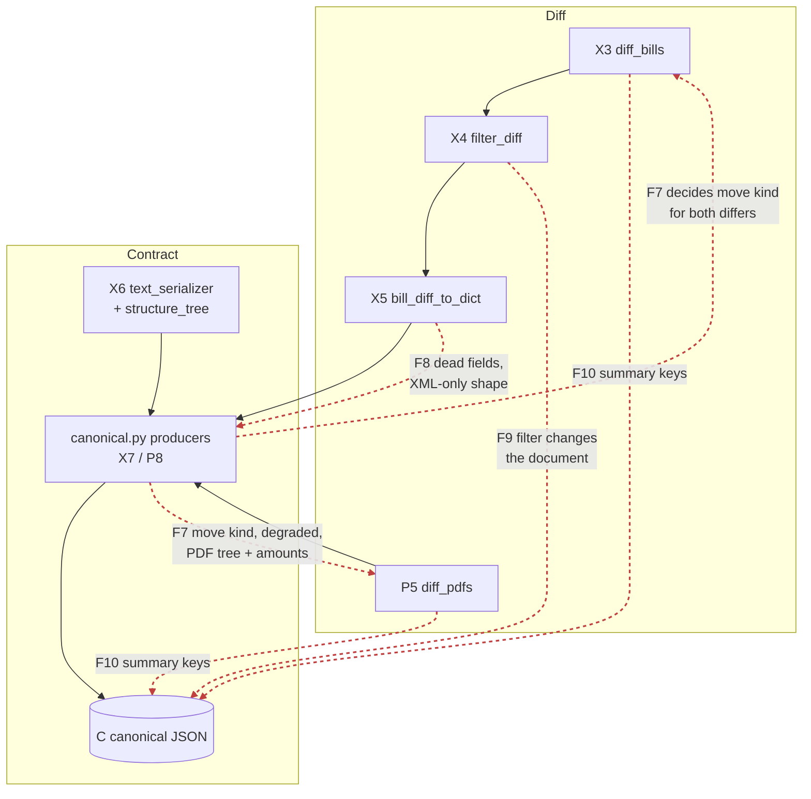
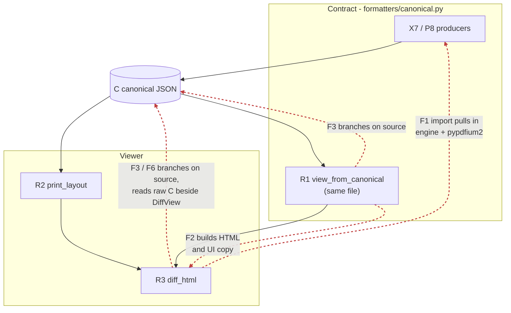
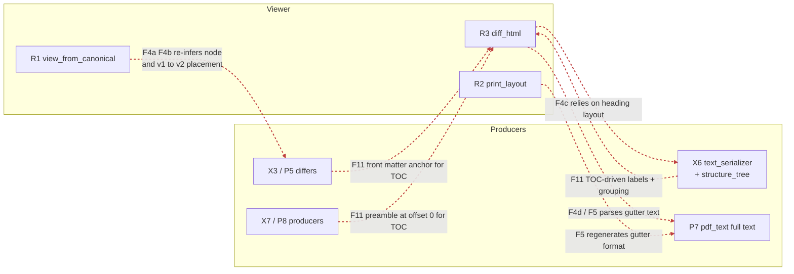

# Pipeline separation audit — scratch

Working notes for the parse → diff → contract → viewer separation refactor. Goal: each
stage can be changed by a different person without touching (or importing) another
stage. Not a published doc; findings graduate to issues/ADRs from here.

- **Started:** 2026-10-04
- **Baseline commit:** `f2e698a` (develop)
- **Status legend:** `open` · `issue filed` · `in progress` · `done` · `won't fix`

## Contents

1. [Stage IDs](#stage-ids)
2. [Overview](#overview-both-paths)
3. [XML pipeline, end to end](#xml-pipeline-end-to-end)
4. [PDF pipeline, end to end](#pdf-pipeline-end-to-end)
5. [Overlap map](#overlap-map) (per seam)
6. [Findings](#findings)
7. [Work log](#work-log)
8. [Open questions](#open-questions)

---

## Stage IDs

Every finding below cites these IDs, so a finding can be located on the diagrams.

| ID | Stage | Owner (file:symbol) | Layer |
|---|---|---|---|
| **E1** | CLI entry (XML) | `diff_bill.py` → `deltatrack.diff_bill:cmd_compare` | entry |
| **E2** | CLI entry (PDF) | `diff_pdf.py` → `deltatrack.diff_pdf:main` → `render_pdf_diff_html` / `render_pdf_diff_json` | entry |
| **E3** | Web entry | `web/app.py:compare` (`POST /api/compare?format=&output=`) | entry |
| **E4** | Examples entry | `scripts/render_examples.py` → `compare_*_files_html` | entry |
| **E5** | Version identity | `version_stems:version_identity_from_filename` (label + ordinal) | entry |
| **X1** | Bytes → temp file | `compare/xml.py:_build` | orchestration |
| **X2** | Parse | `bill_tree:normalize_bill` → `BillTree` of `BillNode` | parse |
| **X3** | Diff | `diff_bill:diff_bills` → `BillDiff` (`NodeDiff`s + summary) | diff |
| **X4** | Filter | `diff_bill:filter_diff` (`--filter`, `--financial`) | diff (?) |
| **X5** | Shape | `diff_bill:bill_diff_to_dict(financial=True)` + label/ordinal overrides | diff → contract |
| **X6** | Full text + tree | `formatters/text_serializer:build_xml_full_text` → `structure_tree:build_xml_tree` | contract (in `formatters/`) |
| **X7** | Canonicalize | `formatters/canonical:xml_diff_to_canonical` | contract |
| **P1** | Bytes → temp file | `compare/pdf.py:_extract_and_diff` | orchestration |
| **P2** | Extract | `parsers/pdf_text:extract_print_pages` (pypdfium2) → `PrintPages` | parse |
| **P3** | Merge breaks | `PrintPages.evidence()` + `merge_print_pages` (own evidence, sibling fallback) → `list[Page]` | parse |
| **P4** | Layout guard | `compare/pdf.py:_is_unnumbered_layout` → `UnsupportedLayoutError` | orchestration (parse logic) |
| **P5** | Diff | `diff_pdf:diff_pdfs` → `PdfDiff` (hunks + anchors) | diff |
| **P6** | Doc identity | `compare/pdf.py:_derive_congress`, `_bill_identity` | orchestration (parse logic) |
| **P7** | Full text + offsets + breaks | `parsers/pdf_text:pdf_full_text`, `pdf_print_breaks` | parse |
| **P8** | Canonicalize | `formatters/canonical:pdf_diff_to_canonical` (+ `_pdf_tree_payload`) | contract |
| **C** | Canonical JSON | `schema/canonical-diff.schema.json` v3.1 — the contract | contract |
| **R1** | View model | `formatters/canonical:view_from_canonical` → `DiffView` | viewer (in contract module) |
| **R2** | Printed layout | `formatters/print_layout:printed_document` (applies `print_breaks`) | viewer |
| **R3** | HTML render | `formatters/diff_html:format_diff_html` | viewer |
| **R4** | Browser runtime | inline `_JS` in `diff_html.py` (filters, find, nav, export) | viewer |

---

## Overview (both paths)

Two producers, one contract, one renderer. `compare/` is the only place a report is
assembled (#42, #693).

---

## XML pipeline, end to end

Entry points converge on `compare/xml.py:_build_from_trees`. The web path enters with
bytes (`compare_xml[_html]` → `_build`, temp files); the CLI and examples parse first
and enter with `BillTree`s (`compare_xml_trees[_html]`, `compare_xml_files_html`).

---

## PDF pipeline, end to end

Entry points converge on `compare/pdf.py:_extract_and_diff` + `_build_canonical`. All
entries hand over bytes; CLI and examples read the file and pass bytes on.

---

## Overlap map

One diagram per seam. Solid black arrows are the intended flow. **Dashed red arrows are
a coupling across a stage boundary**, labelled with the finding (see [Findings](#findings)).
An arrow from A to B reads "A depends on, or decides something for, B".

### Seam A — Parse ↔ Diff ↔ Orchestration

### Seam B — Diff ↔ Contract

### Seam C1 — Contract ↔ Viewer

F1 is also drawn by placement: R1 sits inside the contract module.

### Seam C2 — Viewer reaching upstream, and producers shaped by the viewer

### Findings by stage boundary

| Boundary | Findings |
|---|---|
| Parse ↔ Parse (XML ↔ PDF) | F12 |
| Parse ↔ Orchestration | F7 (P4, P6) |
| Parse ↔ Viewer | F4c, F4d, F5 |
| Diff ↔ Contract | F7, F8, F9, F10 |
| Diff ↔ Viewer | F4a, F4b, F11 (P5 front matter) |
| Diff ↔ Entry/Orchestration | F13 |
| Contract ↔ Viewer | F1, F2, F3, F6, F11 |
| Viewer internal | F6, F14 |

---

## Findings

Ranked by impact on independent work. "Stages" uses the IDs above. Line numbers are
at the baseline commit.

### Summary

| # | Finding | Stages | Seam | Severity | Status |
|---|---|---|---|---|---|
| F1 | Contract producers and viewer input share one module; renderer imports the engine | X7, P8, R1, R3 | Contract ↔ Viewer | High | open |
| F2 | View model carries HTML and UI copy built in the contract module | R1 → R3 | Contract ↔ Viewer | High | open |
| F3 | Viewer branches on `source` (pipeline identity) | R1, R3 | Contract ↔ Viewer | Medium | open |
| F4 | Viewer re-infers facts the contract omits | R1, R3 ← X3, X6, P5, P7 | Diff/Parse ↔ Viewer | High | open |
| F5 | Display gutter baked into PDF `full_text` | P7, R2, R3 | Parse ↔ Viewer | Med-High | open |
| F6 | Renderer reads two inputs (DiffView + raw document) | R1, R3 | Viewer internal | Low-Med | open |
| F7 | Meaning-level decisions made in the canonicalizer and orchestration | X7, P8, P4, P6 | Diff ↔ Contract | Med-High | open |
| F8 | XML-only intermediate dict with dead fields | X5 → X7 | Diff ↔ Contract | Medium | open |
| F9 | Filters run before canonicalization and change the document | X4 | Diff ↔ Contract | Medium | open |
| F10 | `summary` shape differs per pipeline | X3, P5 → C | Diff ↔ Contract | Low-Med | open |
| F11 | Structure tree spans every layer and is shaped by TOC needs | X6, P5, P8, R3 | Producer ↔ Viewer | Medium | open |
| F12 | XML parser imports private PDF parser helpers | X2 ← pdf_anchors | Parse ↔ Parse | Medium | open |
| F13 | Differ modules host CLIs that import back up into `compare/` | E1, E2, X3, P5 | Diff ↔ Entry | Low-Med | open |
| F14 | Minor: structural filter in JS, duplicate bill-type vocab, web palette copy | R3, R4, P6, E3 | Misc | Low | open |
| F15 | No import-direction gate for the pipeline layers | all | Enforcement | Medium | open |

---

### F1 — Contract producers and viewer input share one module

- **Stages:** X7, P8 (producers) · R1 (consumer) · R3 (imports R1)
- **Where:**
  - `src/deltatrack/formatters/canonical.py:25-29` imports `diff_pdf`, `parsers.pdf_anchors`, `structure_tree`.
  - `canonical.py:463-805` is `view_from_canonical` and its helpers (the viewer side).
  - `src/deltatrack/formatters/diff_html.py:21` imports `view_from_canonical`.
- **Evidence:** importing `deltatrack.formatters.diff_html` loads `diff_pdf`, `bill_tree`,
  `matching`, `similarity`, `pdf_observations`, all of `parsers/`, `structure_tree` and
  `pypdfium2` (checked with `sys.modules` after import).
- **Why it matters:** a viewer developer cannot load the renderer without the full engine,
  and a contract change and a viewer change land in the same file and the same review.
- **Direction:** split into `contract/` (producers, `SCHEMA_VERSION`, major guard) and
  `view/` (`view_from_canonical`, join, remap). The renderer should depend on nothing but
  a `dict` that matches the schema.

### F2 — View model carries HTML and UI copy built in the contract module

- **Stages:** R1 → R3
- **Where:** `canonical.py:466-536` (`_join_path`, `_format_range_str`, `_heading_and_nav`,
  `_citation_html`, `_move_info_html`); `formatters/view_model.py` fields `heading_html`,
  `nav_label_html`, `citation_html`, `move_info_html`.
- **Evidence:** CSS classes (`citation`, `move-info`, `v1`, `v2`) and user-facing wording
  ("anchor unresolved · see PDF for context", "— (new in v2)", "Renumbered:", "Moved:")
  are produced in `canonical.py`.
- **Why it matters:** UI wording and class names are edited in the contract module.
- **Direction:** `DiffView` carries raw fields (path parts, location ranges, move dict);
  all markup moves to the renderer.

### F3 — Viewer branches on `source`

- **Stages:** R1, R3 reading C
- **Where:** `canonical.py:490` (`_heading_and_nav`), `canonical.py:717` (`_card_texts`,
  slices `full_text` only when `source == "xml"`), `diff_html.py:529`
  (`_full_text_is_guttered` falls back to source for 3.0 documents).
- **Why it matters:** contradicts ADR 0007 and the `diff_html` docstring ("does not branch
  on which pipeline"). A PDF-side change can require a viewer edit.
- **Direction:** express the difference as data. `_card_texts`' PDF branch exists only
  because of F5; fixing F5 removes it. `degraded` is already a field and can drive the
  heading.

### F4 — Viewer re-infers facts the contract omits (ADR 0006 violation)

ADR 0006: "A consumer may derive by applying facts the document carries; it may not
derive by re-inferring facts the document omits."

- **F4a — which tree node a change belongs to.** Stages R1 ← X3/P5.
  `canonical.py:547-617` (`_span_join_index`, `_join_node_path`) finds the node by
  interval-stabbing text offsets. The producer knows the answer (XML `element_id`, PDF
  anchor) and does not emit it.
- **F4b — where a removed change sits in v2.** Stages R1 ← X3/P5.
  `canonical.py:640` (`_remap_removed_path`) matches v1 breadcrumb labels to v2 tree
  labels (casefold, trailing-path overlap, level tiebreak, document order). That is a
  cross-version correspondence decision made in the view.
- **F4c — heading row offsets.** Stages R3 ← X6.
  `diff_html.py:268` (`_node_anchor_offset`) searches the full text for a line equal to the
  node label; depends on the serializer's heading-emission convention. X6 already computes
  heading offsets (`serialize_tree_for_tree`) and drops them.
- **F4d — line and page numbers.** Stages R3 ← P7.
  `diff_html.py:585-642` (`_parse_full_bill_lines`) slices the gutter (`raw[7:]`, line
  629) to recover line numbers, and derives page numbers by counting blank lines
  (`page += 1`, line 612). The "p. N" label is a count, not the printed `page_number`.
- **Direction:** add to C: tree node ids, a node reference per change (both sides), heading
  offsets, a per-side line table `(page_number, line_number, start, end)`. Schema bump.

### F5 — Display gutter baked into PDF `full_text`

- **Stages:** P7 → C → R2, R3
- **Where:** `parsers/pdf_text.py:808` (`_render_lines` emits `{n:>5}  text`),
  `formatters/print_layout.py:90` (re-emits `f"{line_number:>5}  "`),
  `diff_html.py:629` (strips 7 chars).
- **Why it matters:** three modules in three layers share an undocumented string format.
  Changing gutter width in the UI shifts every character offset in the contract. It is
  also why F3's `_card_texts` refuses to slice PDF text.
- **Direction:** `full_text` holds content only; line numbers move to the line table from
  F4d. The renderer draws the gutter.

### F6 — Renderer reads two inputs

- **Stages:** R1, R3
- **Where:** `format_diff_html` (`diff_html.py:921`) renders cards from `DiffView` but
  sidebar tree, full-bill view, heading and feature gates from the raw document.
  `_node_order_map` (`diff_html.py:178`) and `_v2_label_lookup` (`canonical.py:620`) each
  implement the same "hoist unlabeled nodes" path convention, and must agree for grouping
  to work.
- **Direction:** either `DiffView` becomes the complete view input, or the view model is
  dropped and the renderer reads C directly. Pick one. Put the path convention in one place.

### F7 — Meaning-level decisions made in the canonicalizer and orchestration

- **Stages:** X7, P8, P4, P6
- **Where:**
  - Move kind: `_xml_move` (`canonical.py:121`, from display paths) vs `_pdf_move`
    (`canonical.py:262`, from anchor text). Two rules, decided during serialization.
  - `anchor_resolution` degraded/resolved: `canonical.py:287-293`.
  - PDF tree + `own_amounts` (dollar extraction): `_pdf_tree_payload`,
    `canonical.py:336-397`. XML equivalent is in `structure_tree` via X6. Money computed in
    two different layers.
  - XML span fallback substring search: `_search_span`, `canonical.py:75`.
  - PDF layout guard and document identity: `compare/pdf.py:106`
    (`_is_unnumbered_layout`), `:158` (`_derive_congress`), `:214` (`_bill_identity`).
    XML gets identity from its parser.
- **Why it matters:** the risk map ranks financial diff and the contract as top risks; both
  have logic sitting in serialization and orchestration code instead of their owners.
- **Direction:** move kind and anchor resolution become differ output (`NodeDiff`,
  `PdfHunk`); PDF tree/amounts move beside the XML tree builder; identity and layout
  guard move into `parsers/`.

### F8 — XML-only intermediate dict with dead fields

- **Stages:** X5 → X7
- **Where:** `compare/xml.py:69` calls `bill_diff_to_dict(result, financial=True)`;
  `diff_bill.py:1852-1895`.
- **Evidence:** nothing in `formatters/canonical.py` reads `financial`,
  `financial_summary`, `text_diff` or `match_path`. `PdfHunk.has_amendment_annotations`
  (`diff_pdf.py:102`) also never reaches C. Since #693, the `--financial` multiset facts
  that ADR 0006 calls "untouched" reach no output.
- **Why it matters:** wasted work, and the two producers start from different input shapes
  (dict vs typed `PdfDiff`), so the conversion code can't be shared or symmetric.
- **Direction:** `xml_diff_to_canonical` takes `BillDiff` directly, like the PDF side takes
  `PdfDiff`. Decide what happens to the financial facts (into C, or deleted).

### F9 — Filters run before canonicalization and change the document

- **Stages:** X4 (between X3 and X5)
- **Where:** `compare/xml.py:64` (`filter_diff(filter_text, financial_only)`),
  `diff_bill.py:1898`.
- **Why it matters:** a filtered document looks exactly like a full one (summary
  recomputed, no record of the filter). XML only; PDF has no filter. ADR 0006: variants
  are produced downstream of the document, not upstream.
- **Direction:** always build the full document; filter as a consumer step (or record the
  filter in the document).

### F10 — `summary` shape differs per pipeline

- **Stages:** X3, P5 → C
- **Where:** XML `_count_changes` (`diff_bill.py:1794`) always emits five keys including
  `unchanged`; PDF `PdfDiff.summary` (`diff_pdf.py:112`) emits only types that occur.
  Schema permits any integer-valued keys.
- **Direction:** the producer side computes `summary` from the final `changes` with a fixed
  key set; tighten the schema.

### F11 — Structure tree spans every layer and is shaped by TOC needs

- **Stages:** X6, P5, P8 → R3
- **Where:**
  - `structure_tree.py` imports both `bill_tree` and `parsers.pdf_anchors`; XML tree built
    in `formatters/text_serializer.py`, PDF tree in `formatters/canonical.py`.
  - `structure_tree.py:68-86` picks display labels so a group "renders as a navigable
    toggle"; `:214` front-matter grouping justified by TOC appearance.
  - `parsers/pdf_blocks.py:181` `_with_front_matter` exists "to keep the section TOC
    complete".
  - `canonical.py:357-369` pins the preamble to offset 0 so it "renders as a navigable
    entry (#161)".
- **Why it matters:** TOC changes require edits in parser, differ and producer code.
- **Direction:** the tree describes the bill; the TOC's display rules (hide unlabeled,
  collapse, front-matter grouping) live in the renderer.

### F12 — XML parser imports private PDF parser helpers

- **Stages:** X2 ← pdf_anchors
- **Where:** `bill_tree.py:8` imports `_RUNIN_QUOTED_LINE`, `_match_runin_subsection` from
  `parsers/pdf_anchors`.
- **Why it matters:** an edit to the PDF parser can silently change XML parse output (and
  the XML parser revision, ADR 0019).
- **Direction:** move the shared run-in matching to a neutral module both parsers import.
- **Related:** `diff_pdf.py:58-64` imports private `_Block`, `_flatten`,
  `_group_into_blocks`, `_with_front_matter` from `pdf_blocks`. Within one pipeline, so
  lower priority, but the names say "private".

### F13 — Differ modules host CLIs that import back up

- **Stages:** E1, E2 inside X3, P5
- **Where:** `diff_bill.py:1934-2217` (argparse, version listing, path resolution,
  `cmd_compare`); `diff_pdf.py:1314-1400`. Both lazy-import `compare.*` "to avoid a
  circular import".
- **Direction:** move CLIs to a `cli/` module (or the root wrappers); differ modules stop
  importing `compare/`.

### F14 — Minor

- "Structural" filter defined in the report JS as `type !== 'modified'`
  (`diff_html.py:391, 1380`): a classification rule lives in UI code. (R4)
- Bill-type vocabulary twice: `_DESIGNATORS` (`diff_html.py:450`) and `_BILL_DESIGNATOR`
  regex (`compare/pdf.py`). (R3, P6)
- Web app CSS has its own palette copy (`web/webapp/css/styles.css`, `compare.js`); already
  noted in `palette.py` docstring. (E3)

### F15 — No import-direction gate for the pipeline layers

- **Stages:** all
- **Where:** `tests/test_surface_boundary.py` gates product vs `tools/`/`web/`;
  `tests/test_formatter_boundary.py` gates one constant. Nothing asserts
  parse → diff → contract → viewer direction.
- **Direction:** an AST import-graph test in the style of `test_surface_boundary.py`,
  with an allowlist of today's violations that shrinks as findings close.

---

## Work log

| Date | What | Findings touched |
|---|---|---|
| 2026-10-04 | Initial audit; diagrams; findings F1–F15 recorded. No code changes. | all |

## Open questions

- Keep `DiffView` as the viewer's single input, or drop it and render from C directly? (F6)
- Should `--financial` facts be in the contract, or deleted? ADR 0006 still describes them as available. (F8)
- Is the F4 fix one schema minor (additive fields) or does removing the gutter (F5) force a major?
- Which order: the import gate (F15) first with an allowlist, or F1 split first?
