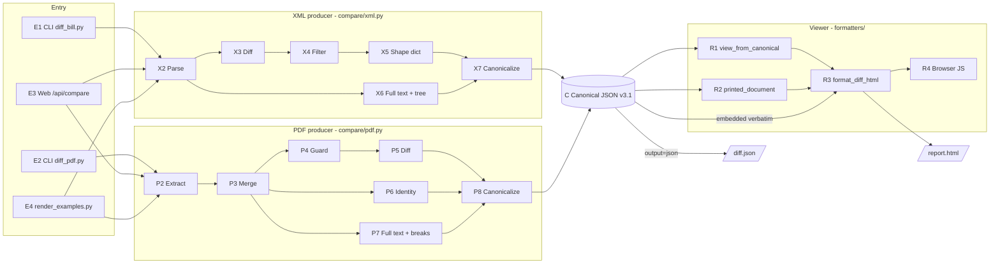
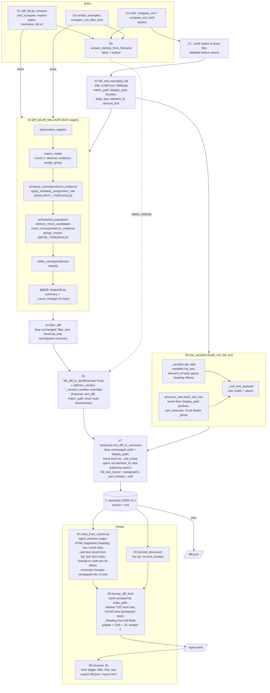
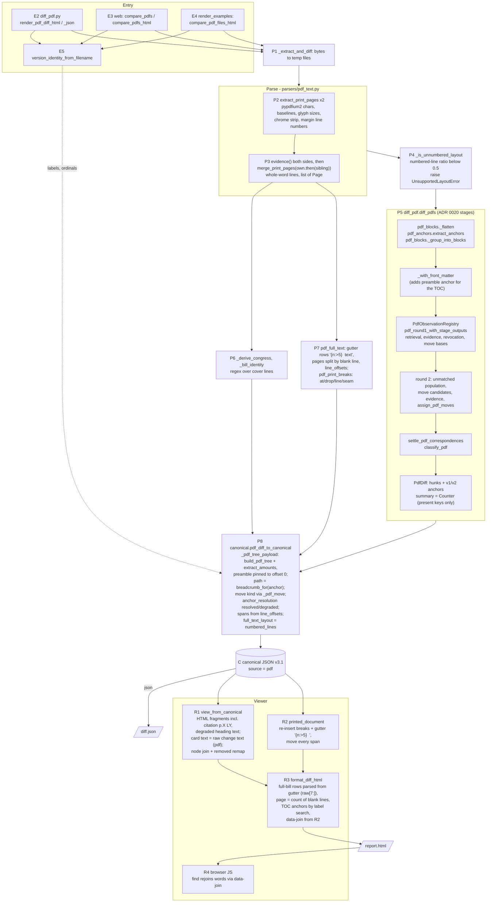
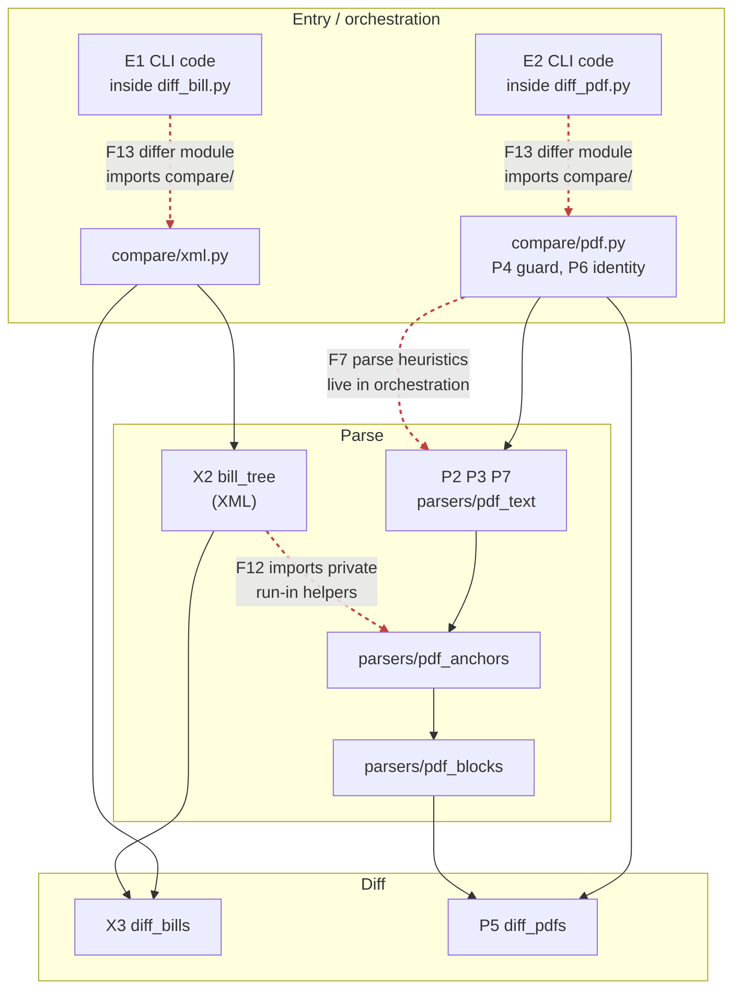
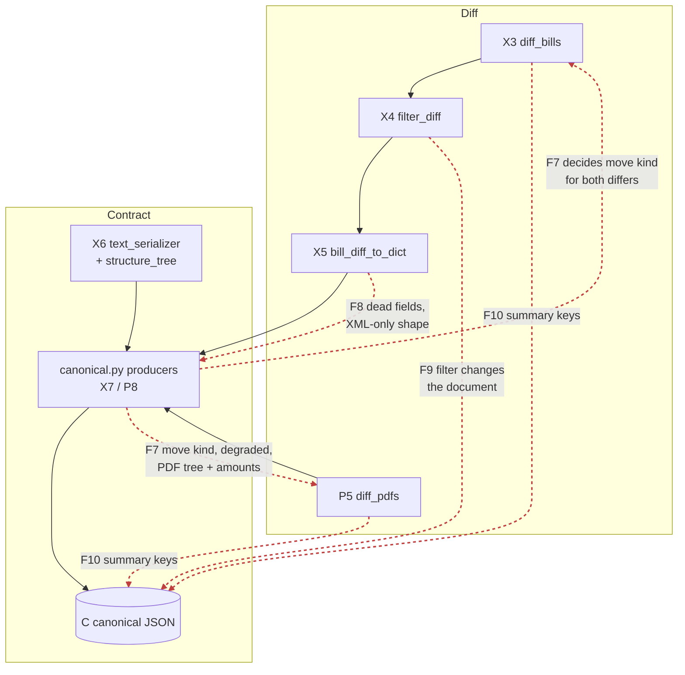
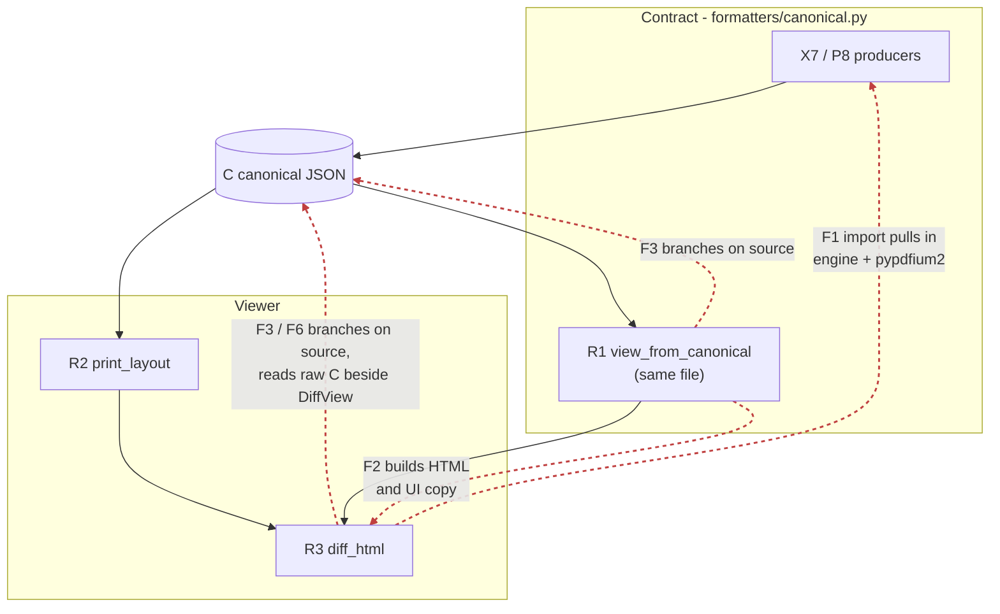
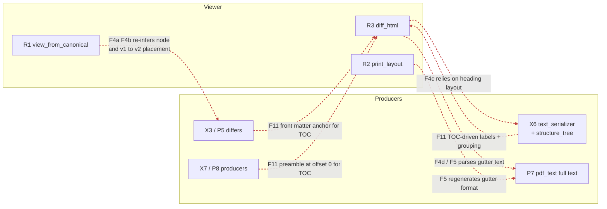

# Pipeline separation audit — scratch

Working notes for the parse → diff → contract → viewer separation refactor. Goal: each
stage can be changed by a different person without touching (or importing) another
stage. Not a published doc; findings graduate to issues/ADRs from here.

- **Started:** 2026-10-04
- **Baseline commit:** `f2e698a` (develop)
- **Status legend:** `open` · `issue filed` · `in progress` · `done` · `won't fix`

## Contents

1. [Current register](#current-register) (authoritative state; read this first)
1. [Decisions](#decisions) (principle; F4b)
2. [Stage IDs](#stage-ids)
3. [Overview](#overview-both-paths)
4. [XML pipeline, end to end](#xml-pipeline-end-to-end)
5. [PDF pipeline, end to end](#pdf-pipeline-end-to-end)
6. [Overlap map](#overlap-map) (per seam)
7. [Findings](#findings) (round 1 write-up; see the register for corrections)
8. [Falsification pass](#falsification-pass) (round 1)
9. [Review round 2](#review-round-2)
10. [Review round 3](#review-round-3)
11. [Review round 4 (final)](#review-round-4-final)
12. [Mapping to #653 and existing issues](#mapping-to-653-and-existing-issues)
13. [Design draft](#design-draft)
14. [Open PRs vs. the node-identity gap](#open-prs-vs-the-node-identity-gap)
15. [Ideal design: nodes, correspondence, ledger](#ideal-design-nodes-correspondence-and-the-ledger-as-a-consumer)
16. [External review of the brief](#external-review-of-the-brief-2026-10-05)
17. [Work log](#work-log)
18. [Open questions](#open-questions)

---

## Current register

**Converged after review round 4 (2026-10-04).** This is the corrected statement of every
finding and supersedes the earlier per-finding sections wherever they disagree.
- **Corpus:** 27 adjacent XML pairs (17,873 changes) and 17 accepted PDF pairs (6,371
  changes; 6 declined as unnumbered).
- **Baseline:** `f2e698a`.
- **Status on `develop` (`9cfadee`, checked after round 4):** a syntax-tree comparison that
  ignores comments and docstrings shows **no code change** in any module these findings cite,
  except `formatters/diff_html.py`. There, the TOC-anchor search was re-indexed (`cde9e7f`,
  same label-match semantics) and the CSS moved to package stylesheets (#768). Two findings
  changed status because of repository *decisions*, not code: see F4d and F5.

### Open findings

| ID | Finding | Key evidence | Owning issue | Severity |
|---|---|---|---|---|
| **F4b** | Removed changes are filed into the v2 grouping by label, deepest segment first (`_remap_removed_path`), so generic labels match unrelated nodes | **XML:** 93 of 582 joined removals land outside the deepest v1 ancestor that still exists in v2 (case-insensitive label path), 48 under a different top-level group. **PDF:** 26 of 190, 24. Example: 114-hr-2029 4→5 `c-0046`, visible in rendered HTML. `schema/canonical-diff.md:242-243` says pairing is the engine's job. The 5 remap unit tests use no cross-parent case; the corpus gate skips removals. | **none.** The mechanism (no change→node key) is assigned to #552 by #653's closing comment | **High** (defect) |
| **F1** | `formatters/canonical.py` holds the producers and `view_from_canonical`, so importing the renderer loads the PDF differ, both parsers and `pypdfium2` | The viewer half shares only `SCHEMA_VERSION`. A simulated split renders byte-identical on all 27 + 17 pairs; renderer import drops to ~30–53 ms with no `pypdfium2`. Friction: 5 test files import `view_from_canonical`; `test_canonical_node_join.py:353` monkeypatches `canonical._span_join_index`; the `pdf_move_user_facing.py` probe would break **silently** (`test_research_probes.py` scans only provision-matching probes); docs name the location. | #62 (edge), #751 (`pypdfium2` route) | Med-High |
| **F7a** | `move.kind` is decided in `canonical.py` by two rules (`_xml_move`, `_pdf_move`) | Flip 167 of 496 XML and 85 of 161 PDF moves, exactly when parent and last label both change. The PDF rule labels **18** line-wrap fragments "renumbered" (a 19th prefix pair, 118-hr-2882 4→5 `SEC. 2` → `SEC. 202`, is a genuine renumbering). The XML rule calls 7 one-element paths "renumbered". `_xml_move`'s docstring is false. `diff_pdf` records `move_basis` as "deliberately not a legislative claim", yet the canonicalizer re-decides. `body_unchanged` has three definitions, which disagree on 9 moves. No unit test for "both changed"; the baselines pin today's answer without judging it. | #648 (PDF side only) | Medium |
| **F15** | No test guards the import direction for viewer → producers/parsers, the XML parser, differ → viewer, or differ → `compare/` | 4 planted violations pass every boundary gate (233 passed). The full suite fails only the 27 provenance checks, which a comment also trips. `formatters/` already imports producers, so a gate must start at `diff_html`. | #62 (acyclic gate) | Medium |
| **F16** | `structure_tree` types `division` / `title` by regex over display labels | GPO-form division labels change both sides' root levels: v2 `{division:7, preamble:1}` → `{heading:7, section:6, preamble:1}`, and v1 loses Front Matter. The change set is unchanged apart from label text. | **#471**, epic #552, #557 (the missing render-invariance test) | Medium |
| **F5** | PDF `full_text` embeds a 7-character gutter (5-wide number plus 2 spaces) | Width encoded in 5 places: `_render_lines`, `_GUTTER_WIDTH`, `amounts.GUTTER_RE`, `_parse_full_bill_lines`, `print_layout`. Caused #670: 426 of 1,100 annotations leak under the pre-#670 regex (the commit says 428). 9.6% of `full_text`. `amounts.py` also holds a dead page-hyphen rule (0 matches since 3.1). **Status:** kept by #653's 2026-08-19 decision, and ADR 0006 on `develop` (#769) now names `full_text_layout` as a carried fact. So the ADR conflict is resolved by decision; the #670-class cost and the five copies remain. | #656, #95 | Low-Med (was Medium) |
| **F3** | `_card_texts` decides layout from `versions.v1.source` (`canonical.py:784`), even in 3.1 documents | Flipping `v1.source` changes 7,290 of 17,873 cards (whitespace only); flipping `v2` changes 0. The schema's 3.0 fallback names `v2.source`. The renderer correctly reads `full_text_layout`. Blocks #95. | #95 (#653 closed) | Low-Med |
| **F4a** | Empty-body section changes (1,634 `sec.`, 42 `Sec.`) have no span in the document, so the offset join cannot place them | 1,677 of 17,873 unjoined (9.38%); 1,676 are #188 empty-body sections with null span and a `path` (1,548 added, 128 removed). 1,622 produce 111 duplicated top-level headings. `test_node_join_corpus.py:90` skips them. PDF: 51 of 6,371. | **#701**; mechanism → #552 | Low-Med |
| **F4c** | TOC heading rows are found by matching the label against `full_text` | Decides 9,717 of 34,715 XML v2 nodes (28%), never wrong. The exposed heading map keeps the first occurrence, so emitting it as-is would misplace 63. "Receipts collected" own-line flaw on 5 trees, 3 bills. PDF always falls back, harmlessly. Same semantics on `develop` after `cde9e7f`. | **#766** | Low-Med |
| **F7b** | PDF identity is regex over the new side (`congress` from `pages[0].lines[:10]`; type, number and title from the first ~1,500 characters, `compare/pdf.py:223-228`); XML identity takes type, number and congress from the **old** tree | PDF `congress` empty in 6 of 17 pairs (old side has it in 4); `_bill_identity` untested. **4 of 27 XML pairs emit empty `bill.type` and `number`**; XML title null in 9 of 27. | none | Low-Med |
| **F8** | `compare/xml.py` computes `bill_diff_to_dict(financial=True)` and canonical ignores the result | Byte-identical without `financial`, `text_diff`, `match_path` on 27 of 27 pairs; ~8% of XML compare time. Docstrings and `architecture.md:59` describe a dead purpose. #698's "Unverified" note assumes the financial step needs a destination; it has none. | **#698** | Low-Med |
| **F9** | The CLI filters before canonicalization, on internal `match_path` | `summary` recomputed, no marker (tested; README:178 documents the recount for `--financial` only). `--filter "TITLE II"` → 0 changes vs 13 breadcrumbs, because `match_path` drops the title. `--help` wording is wrong. | **none** (closest: #764, #691) | Low-Med |
| **F11** | The display string "Front Matter" is a cross-stage key, and `""` labels act as a TOC hide flag | Defined twice; string-equality at `structure_tree.py:243`; part of the PDF `_block_key`. Non-root `""` labels: 101 in paired documents, 173 across 58 XML documents; outside the schema's definition. XML front-matter paths are `null`, PDF ones `["Front Matter"]`. Guarded by `test_front_matter_parity`. | #552, #557, #161 | Low-Med |
| **F12** | The XML parser imports private PDF-anchor helpers (deliberate label parity) | Disabling the PDF matcher changes 17 XML keys (10 distinct, 3 bills). `bill_tree` import loads the PDF modules and `pypdfium2`. The XML parser revision hashes the PDF modules: a comment-only edit to `pdf_text.py` fails 27 provenance checks (documented over-breadth). Catchline wording is asserted only on the synthetic Sec. 547 snippets in `test_bill_tree.py` and on the real Sec. 547 in `test_sec_547`. | #62, #751 | Low-Med |
| **F17** | XML `changes[].text` is the matcher's normalized `body_text`; the card shows readable `full_text` | `diff.json` and the card disagree on 7,916 of 17,534 non-empty sides (whitespace only). `path` mixes `sec.` (12,954) and `Sec.` (305). | #76 (fixed in the viewer by PR #81, not in the contract); #698 touches the same adapter | Low-Med |
| **F13** | CLIs live inside `diff_bill.py` / `diff_pdf.py`; four cycles exist through function-local imports | `compare.xml → diff_bill ⇢ compare.xml`; `compare.pdf → diff_pdf ⇢ compare.pdf`; `compare.pdf → canonical → diff_pdf ⇢ compare.pdf`; `diff_html → canonical → diff_pdf ⇢ compare.pdf → diff_html`. No cycle is module-level only. The `__init__.py` docstring and #62 describe a dead cycle. Library functions sit under CLI headers. | ADR 0017, #62 | Low |
| **F10** | XML `summary` always has five keys including `unchanged` (always 0); PDF emits only present types | 7 PDF key sets over 17 pairs. No consumer is affected. | **#706** (fix PR #731 open) | Low |
| **F6** | The renderer reads both `DiffView` and the raw document; the "hoist unlabeled nodes" path rule is implemented three times (`_span_join_index` `canonical.py:573`, `_v2_label_lookup` `canonical.py:630`, `_node_order_map` `diff_html.py:195`), plus a fourth for the TOC in `_build_tree_nav` | Reading the document directly is sanctioned by ADR 0007. Only the join's copy is guarded (`test_canonical_node_join.py:152`); the other two are inert on the corpus and untested. | none | Low |

### Resolved by decision on `develop`

- **F4d.** The renderer recovers line and page numbers by parsing the documented
  `numbered_lines` gutter.
  - Correct on all 160,175 printed rows of the 17 accepted pairs.
  - All 120,209 `line_offsets` entries land on row starts.
  - At baseline this conflicted with ADR 0006:73-75 ("belongs in the document") and with
    #653's verification check 2.
  - On `develop`, #769 rewrote that bound to name `full_text_layout` as the carried fact the
    report applies, and #653 was closed as completed (shipped in #755).
  - So parsing the layout is now the recorded design. No further action unless the gutter
    decision (F5) is revisited.

### Dismissed (held through rounds 2–4)

- **F2.** HTML and UI wording in the view model is sanctioned by ADR 0007. The residual cost is
  F1's, plus duplicated wording in the renderer: `_move_note` vs `_move_info_html`, "(unknown
  location)" vs "(unknown)", and `diff_html.py:685` re-implementing `_join_path`.
- **F14.** The "Structural" filter applies the carried `change_type`. The bill-type vocabulary
  is two lists plus one rule; `bill.type` is a free string with an `.upper()` fallback.

### Not tracked in any issue

- **F4b**: misfiled removals.
- **F7a, XML side**: the rule mismatch, the false docstring, and `body_unchanged`.
- **F7b**: XML pairs emitting an empty identity.
- **F9**: the filter keyed on `match_path`.
- **F6**.

---

## Decisions

### Principle (agreed 2026-10-05)

> **The viewer faithfully represents the diff.** It does not decide correspondence, placement
> or structure that the engine did not decide. Where the diff doesn't say, the viewer shows
> what it does know and says no more.

This is the standing test for viewer work. It is a candidate for an explicit line in ADR 0007
(single renderer), next to "the renderer does not branch on pipeline identity".

### F4b: removed changes → a "Removed" section with pointers (option c, agreed 2026-10-05)

**Behaviour in the Changes view and sidebar:**

1. **No removal is placed in the new version's outline groups.**
2. **A "Removed from the earlier version" section** follows the outline groups. It is nested by
   each removal's own old location (`changes[].path.v1`) and ordered by the earlier version's
   document order. Removals with no old path go in an "(outside the earlier version's
   outline)" subgroup.
3. **Pointers.**
   - A new-version group whose **full heading path equals** a removal's old parent path
     exactly gets a note: "N removed provisions were under a heading with this name in the
     earlier version", linking to them.
   - There are no partial or deepest-label matches. A heading that moved under a new wrapper
     (e.g. `Division J › TITLE I …`) gets no pointer, an honest miss.
   - The wording states only what is known: same name, not same place.
4. **The Full bill view is unchanged.** Its "Removed in end version" appendix already lists
   removals under their old path, so the two views become consistent.

**Removed code:** `_remap_removed_path` and `_v2_label_lookup` (`formatters/canonical.py`),
and the v1 branch of `_node_path_for_change`.

**Tests:**
- No removed change appears inside a new-version group.
- A pointer appears on an exact path match.
- No pointer in the wrapper case (114-hr-2029 5→6 `c-0013`).
- No pointer in the label-collision case (114-hr-2029 4→5 `c-0046` must **not** point at
  TITLE II › … › sec. 227 › (a)).
- Every removal appears exactly once.

**Measured effect:**
- Today's 93 misfiled removals (48 across titles) go to zero.
- About half of the placeable removals get a pointer: 285 of 582 have an exact surviving parent
  path.
- The 128 removals with no text span, which today fall into trailing fallback groups (#701),
  get their old location from `path.v1`.

**Dependencies:**
- None. It uses only `path.v1`, which the contract already carries, so it can ship before node
  IDs (step 1).
- When the engine one day publishes settled container correspondence (on hold), removals can
  move inline using that data instead of labels.

**Relation to issues:**
- Records and issue draft: draft PR civictechdc/DeltaTrack#782.
- Replaces the earlier F4b fix-task idea.
- Partly overlaps #701: trailing groups for unplaced changes.

---

## Stage IDs

Every finding below cites these IDs, so a finding can be located on the diagrams.

| ID | Stage | Owner (file:symbol) | Layer |
|---|---|---|---|
| **E1** | CLI entry (XML) | `diff_bill.py` → `deltatrack.diff_bill:cmd_compare` | entry |
| **E2** | CLI entry (PDF) | `diff_pdf.py` → `deltatrack.diff_pdf:main` → `render_pdf_diff_html` / `render_pdf_diff_json` | entry |
| **E3** | Web entry | `web/app.py:compare` (`POST /api/compare?format=&output=`) | entry |
| **E4** | Examples entry | `scripts/render_examples.py` → `compare_*_files_html` | entry |
| **E5** | Version identity | `version_stems:version_identity_from_filename` (label + ordinal) | entry |
| **X1** | Bytes → temp file | `compare/xml.py:_build` | orchestration |
| **X2** | Parse | `bill_tree:normalize_bill` → `BillTree` of `BillNode` | parse |
| **X3** | Diff | `diff_bill:diff_bills` → `BillDiff` (`NodeDiff`s + summary) | diff |
| **X4** | Filter | `diff_bill:filter_diff` (`--filter`, `--financial`) | diff (?) |
| **X5** | Shape | `diff_bill:bill_diff_to_dict(financial=True)` + label/ordinal overrides | diff → contract |
| **X6** | Full text + tree | `formatters/text_serializer:build_xml_full_text` → `structure_tree:build_xml_tree` | contract (in `formatters/`) |
| **X7** | Canonicalize | `formatters/canonical:xml_diff_to_canonical` | contract |
| **P1** | Bytes → temp file | `compare/pdf.py:_extract_and_diff` | orchestration |
| **P2** | Extract | `parsers/pdf_text:extract_print_pages` (pypdfium2) → `PrintPages` | parse |
| **P3** | Merge breaks | `PrintPages.evidence()` + `merge_print_pages` (own evidence, sibling fallback) → `list[Page]` | parse |
| **P4** | Layout guard | `compare/pdf.py:_is_unnumbered_layout` → `UnsupportedLayoutError` | orchestration (parse logic) |
| **P5** | Diff | `diff_pdf:diff_pdfs` → `PdfDiff` (hunks + anchors) | diff |
| **P6** | Doc identity | `compare/pdf.py:_derive_congress`, `_bill_identity` | orchestration (parse logic) |
| **P7** | Full text + offsets + breaks | `parsers/pdf_text:pdf_full_text`, `pdf_print_breaks` | parse |
| **P8** | Canonicalize | `formatters/canonical:pdf_diff_to_canonical` (+ `_pdf_tree_payload`) | contract |
| **C** | Canonical JSON | `schema/canonical-diff.schema.json` v3.1 — the contract | contract |
| **R1** | View model | `formatters/canonical:view_from_canonical` → `DiffView` | viewer (in contract module) |
| **R2** | Printed layout | `formatters/print_layout:printed_document` (applies `print_breaks`) | viewer |
| **R3** | HTML render | `formatters/diff_html:format_diff_html` | viewer |
| **R4** | Browser runtime | inline `_JS` in `diff_html.py` (filters, find, nav, export) | viewer |

---

## Overview (both paths)

Two producers, one contract, one renderer. `compare/` is the only place a report is
assembled (#42, #693).



---

## XML pipeline, end to end

Entry points converge on `compare/xml.py:_build_from_trees`. The web path enters with
bytes (`compare_xml[_html]` → `_build`, temp files); the CLI and examples parse first
and enter with `BillTree`s (`compare_xml_trees[_html]`, `compare_xml_files_html`).



---

## PDF pipeline, end to end

Entry points converge on `compare/pdf.py:_extract_and_diff` + `_build_canonical`. All
entries hand over bytes; CLI and examples read the file and pass bytes on.



---

## Overlap map

One diagram per seam. Solid black arrows are the intended flow. **Dashed red arrows are
a coupling across a stage boundary**, labelled with the finding (see [Findings](#findings)).
An arrow from A to B reads "A depends on, or decides something for, B".

### Seam A — Parse ↔ Diff ↔ Orchestration



### Seam B — Diff ↔ Contract



### Seam C1 — Contract ↔ Viewer



F1 is also drawn by placement: R1 sits inside the contract module.

### Seam C2 — Viewer reaching upstream, and producers shaped by the viewer



### Findings by stage boundary

| Boundary | Findings |
|---|---|
| Parse ↔ Parse (XML ↔ PDF) | F12 |
| Parse ↔ Orchestration | F7 (P4, P6) |
| Parse ↔ Viewer | F4c, F4d, F5 |
| Diff ↔ Contract | F7, F8, F9, F10 |
| Diff ↔ Viewer | F4a, F4b, F11 (P5 front matter) |
| Diff ↔ Entry/Orchestration | F13 |
| Contract ↔ Viewer | F1, F2, F3, F6, F11 |
| Viewer internal | F6, F14 |

---

## Findings

Ranked by impact on independent work. "Stages" uses the IDs above. Line numbers are
at the baseline commit.

### Summary

| # | Finding | Stages | Seam | Severity (was → now) | Verdict | Status |
|---|---|---|---|---|---|---|
| F1 | Contract producers and viewer input share one module; renderer imports the engine | X7, P8, R1, R3 | Contract ↔ Viewer | High → Med-High | **Holds**, low runtime cost | open |
| F2 | View model carries HTML and UI copy built in the contract module | R1 → R3 | Contract ↔ Viewer | High → Low | **Falsified** (ADR 0007 by design) | open |
| F3 | Viewer branches on `source` (pipeline identity) | R1, R3 | Contract ↔ Viewer | Medium → Low | **Mostly falsified**; rests on F5 | open |
| F4 | Viewer re-infers facts the contract omits | R1, R3 ← X3, X6, P5, P7 | Diff/Parse ↔ Viewer | High → High | **Split**: a narrowed, b **defect**, c holds, d falsified | open |
| F5 | Display gutter baked into PDF `full_text` | P7, R2, R3 | Parse ↔ Viewer | Med-High → Low | **Mostly falsified** (documented in schema) | open |
| F6 | Renderer reads two inputs (DiffView + raw document) | R1, R3 | Viewer internal | Low-Med → Low | **Partly falsified** | open |
| F7 | Meaning-level decisions made in the canonicalizer and orchestration | X7, P8, P4, P6 | Diff ↔ Contract | Med-High → Medium | **Split**: move kind + identity hold; rest falsified | open |
| F8 | XML-only intermediate dict with dead fields | X5 → X7 | Diff ↔ Contract | Medium → Medium | **Holds**, confirmed | open |
| F9 | Filters run before canonicalization and change the document | X4 | Diff ↔ Contract | Medium → Low-Med | **Holds**, CLI-only | open |
| F10 | `summary` shape differs per pipeline | X3, P5 → C | Diff ↔ Contract | Low-Med → Low-Med | **Holds**, confirmed | open |
| F11 | Structure tree spans every layer and is shaped by TOC needs | X6, P5, P8, R3 | Producer ↔ Viewer | Medium → Low | **Mostly falsified** | open |
| F12 | XML parser imports private PDF parser helpers | X2 ← pdf_anchors | Parse ↔ Parse | Medium → Low | **Partly falsified** (sharing is deliberate) | open |
| F13 | Differ modules host CLIs that import back up into `compare/` | E1, E2, X3, P5 | Diff ↔ Entry | Low-Med → Low | **Partly falsified** | open |
| F14 | Minor: structural filter in JS, duplicate bill-type vocab, web palette copy | R3, R4, P6, E3 | Misc | Low → nit | **Mostly falsified** | open |
| F15 | No import-direction gate for the pipeline layers | all | Enforcement | Medium → Medium | **Partly falsified** (3 gates exist) | open |
| F16 | Division display label decides structural level in the tree | X2 → X6 → C → R3 | Parse ↔ Contract | — → Medium | **New in round 2**, reproduced | open |
| F17 | XML `changes[].text` is the matcher's normalized body; view swaps text for XML only | X3 → C → R1 | Diff ↔ Contract | — → Low-Med | **New in round 2**, reproduced | open |

---

### F1 — Contract producers and viewer input share one module

> **Falsification verdict:** Holds. Viewer half uses no producer names; split is mechanical. Runtime cost ~0.2 s, no install cost. See [falsification pass](#falsification-pass).

- **Stages:** X7, P8 (producers) · R1 (consumer) · R3 (imports R1)
- **Where:**
  - `src/deltatrack/formatters/canonical.py:25-29` imports `diff_pdf`, `parsers.pdf_anchors`, `structure_tree`.
  - `canonical.py:463-805` is `view_from_canonical` and its helpers (the viewer side).
  - `src/deltatrack/formatters/diff_html.py:21` imports `view_from_canonical`.
- **Evidence:** importing `deltatrack.formatters.diff_html` loads `diff_pdf`, `bill_tree`,
  `matching`, `similarity`, `pdf_observations`, all of `parsers/`, `structure_tree` and
  `pypdfium2` (checked with `sys.modules` after import).
- **Why it matters:** a viewer developer cannot load the renderer without the full engine,
  and a contract change and a viewer change land in the same file and the same review.
- **Direction:** split into `contract/` (producers, `SCHEMA_VERSION`, major guard) and
  `view/` (`view_from_canonical`, join, remap). The renderer should depend on nothing but
  a `dict` that matches the schema.

### F2 — View model carries HTML and UI copy built in the contract module

> **Falsification verdict:** Falsified as a defect. ADR 0007 puts this display work in view building on purpose. See [falsification pass](#falsification-pass).

- **Stages:** R1 → R3
- **Where:** `canonical.py:466-536` (`_join_path`, `_format_range_str`, `_heading_and_nav`,
  `_citation_html`, `_move_info_html`); `formatters/view_model.py` fields `heading_html`,
  `nav_label_html`, `citation_html`, `move_info_html`.
- **Evidence:** CSS classes (`citation`, `move-info`, `v1`, `v2`) and user-facing wording
  ("anchor unresolved · see PDF for context", "— (new in v2)", "Renumbered:", "Moved:")
  are produced in `canonical.py`.
- **Why it matters:** UI wording and class names are edited in the contract module.
- **Direction:** `DiffView` carries raw fields (path parts, location ranges, move dict);
  all markup moves to the renderer.

### F3 — Viewer branches on `source`

> **Falsification verdict:** Mostly falsified. ADR 0007 allows source-specific work in R1; R3's check is the documented 3.0 shim. See [falsification pass](#falsification-pass).

- **Stages:** R1, R3 reading C
- **Where:** `canonical.py:490` (`_heading_and_nav`), `canonical.py:717` (`_card_texts`,
  slices `full_text` only when `source == "xml"`), `diff_html.py:529`
  (`_full_text_is_guttered` falls back to source for 3.0 documents).
- **Why it matters:** contradicts ADR 0007 and the `diff_html` docstring ("does not branch
  on which pipeline"). A PDF-side change can require a viewer edit.
- **Direction:** express the difference as data. `_card_texts`' PDF branch exists only
  because of F5; fixing F5 removes it. `degraded` is already a field and can drive the
  heading.

### F4 — Viewer re-infers facts the contract omits (ADR 0006 violation)

> **Falsification verdict:** 4a narrowed (9.4% XML unjoined) · 4b demonstrated defect (93 misfiled) · 4c holds (8,723 offsets dropped) · 4d falsified (0/6,130 mismatches). See [falsification pass](#falsification-pass).

ADR 0006: "A consumer may derive by applying facts the document carries; it may not
derive by re-inferring facts the document omits."

- **F4a — which tree node a change belongs to.** Stages R1 ← X3/P5.
  `canonical.py:547-617` (`_span_join_index`, `_join_node_path`) finds the node by
  interval-stabbing text offsets. The producer knows the answer (XML `element_id`, PDF
  anchor) and does not emit it.
- **F4b — where a removed change sits in v2.** Stages R1 ← X3/P5.
  `canonical.py:640` (`_remap_removed_path`) matches v1 breadcrumb labels to v2 tree
  labels (casefold, trailing-path overlap, level tiebreak, document order). That is a
  cross-version correspondence decision made in the view.
- **F4c — heading row offsets.** Stages R3 ← X6.
  `diff_html.py:268` (`_node_anchor_offset`) searches the full text for a line equal to the
  node label; depends on the serializer's heading-emission convention. X6 already computes
  heading offsets (`serialize_tree_for_tree`) and drops them.
- **F4d — line and page numbers.** Stages R3 ← P7.
  `diff_html.py:585-642` (`_parse_full_bill_lines`) slices the gutter (`raw[7:]`, line
  629) to recover line numbers, and derives page numbers by counting blank lines
  (`page += 1`, line 612). The "p. N" label is a count, not the printed `page_number`.
- **Direction:** add to C: tree node ids, a node reference per change (both sides), heading
  offsets, a per-side line table `(page_number, line_number, start, end)`. Schema bump.

### F5 — Display gutter baked into PDF `full_text`

> **Falsification verdict:** Mostly falsified. Format is specified in `schema/canonical-diff.md:180`; residual is string encoding. See [falsification pass](#falsification-pass).

- **Stages:** P7 → C → R2, R3
- **Where:** `parsers/pdf_text.py:808` (`_render_lines` emits `{n:>5}  text`),
  `formatters/print_layout.py:90` (re-emits `f"{line_number:>5}  "`),
  `diff_html.py:629` (strips 7 chars).
- **Why it matters:** three modules in three layers share an undocumented string format.
  Changing gutter width in the UI shifts every character offset in the contract. It is
  also why F3's `_card_texts` refuses to slice PDF text.
- **Direction:** `full_text` holds content only; line numbers move to the line table from
  F4d. The renderer draws the gutter.

### F6 — Renderer reads two inputs

> **Falsification verdict:** Partly falsified. Reading C directly is by design (ADR 0007); duplicate path rule remains. See [falsification pass](#falsification-pass).

- **Stages:** R1, R3
- **Where:** `format_diff_html` (`diff_html.py:921`) renders cards from `DiffView` but
  sidebar tree, full-bill view, heading and feature gates from the raw document.
  `_node_order_map` (`diff_html.py:178`) and `_v2_label_lookup` (`canonical.py:620`) each
  implement the same "hoist unlabeled nodes" path convention, and must agree for grouping
  to work.
- **Direction:** either `DiffView` becomes the complete view input, or the view model is
  dropped and the renderer reads C directly. Pick one. Put the path convention in one place.

### F7 — Meaning-level decisions made in the canonicalizer and orchestration

> **Falsification verdict:** Move-kind rules disagree on 85/161 PDF moves; identity placement holds; `anchor_resolution` falsified; amounts is duplication, not layer. See [falsification pass](#falsification-pass).

- **Stages:** X7, P8, P4, P6
- **Where:**
  - Move kind: `_xml_move` (`canonical.py:121`, from display paths) vs `_pdf_move`
    (`canonical.py:262`, from anchor text). Two rules, decided during serialization.
  - `anchor_resolution` degraded/resolved: `canonical.py:287-293`.
  - PDF tree + `own_amounts` (dollar extraction): `_pdf_tree_payload`,
    `canonical.py:336-397`. XML equivalent is in `structure_tree` via X6. Money computed in
    two different layers.
  - XML span fallback substring search: `_search_span`, `canonical.py:75`.
  - PDF layout guard and document identity: `compare/pdf.py:106`
    (`_is_unnumbered_layout`), `:158` (`_derive_congress`), `:214` (`_bill_identity`).
    XML gets identity from its parser.
- **Why it matters:** the risk map ranks financial diff and the contract as top risks; both
  have logic sitting in serialization and orchestration code instead of their owners.
- **Direction:** move kind and anchor resolution become differ output (`NodeDiff`,
  `PdfHunk`); PDF tree/amounts move beside the XML tree builder; identity and layout
  guard move into `parsers/`.

### F8 — XML-only intermediate dict with dead fields

> **Falsification verdict:** Confirmed. Canonical identical without the fields on 27/27 pairs; 6,720 financial entries discarded. See [falsification pass](#falsification-pass).

- **Stages:** X5 → X7
- **Where:** `compare/xml.py:69` calls `bill_diff_to_dict(result, financial=True)`;
  `diff_bill.py:1852-1895`.
- **Evidence:** nothing in `formatters/canonical.py` reads `financial`,
  `financial_summary`, `text_diff` or `match_path`. `PdfHunk.has_amendment_annotations`
  (`diff_pdf.py:102`) also never reaches C. Since #693, the `--financial` multiset facts
  that ADR 0006 calls "untouched" reach no output.
- **Why it matters:** wasted work, and the two producers start from different input shapes
  (dict vs typed `PdfDiff`), so the conversion code can't be shared or symmetric.
- **Direction:** `xml_diff_to_canonical` takes `BillDiff` directly, like the PDF side takes
  `PdfDiff`. Decide what happens to the financial facts (into C, or deleted).

### F9 — Filters run before canonicalization and change the document

> **Falsification verdict:** Confirmed on 25/27 pairs; CLI-only, so lower severity. See [falsification pass](#falsification-pass).

- **Stages:** X4 (between X3 and X5)
- **Where:** `compare/xml.py:64` (`filter_diff(filter_text, financial_only)`),
  `diff_bill.py:1898`.
- **Why it matters:** a filtered document looks exactly like a full one (summary
  recomputed, no record of the filter). XML only; PDF has no filter. ADR 0006: variants
  are produced downstream of the document, not upstream.
- **Direction:** always build the full document; filter as a consumer step (or record the
  filter in the document).

### F10 — `summary` shape differs per pipeline

> **Falsification verdict:** Confirmed. XML: one 5-key set on 27/27; PDF: 7 different key sets across 17 pairs. See [falsification pass](#falsification-pass).

- **Stages:** X3, P5 → C
- **Where:** XML `_count_changes` (`diff_bill.py:1794`) always emits five keys including
  `unchanged`; PDF `PdfDiff.summary` (`diff_pdf.py:112`) emits only types that occur.
  Schema permits any integer-valued keys.
- **Direction:** the producer side computes `summary` from the final `changes` with a fixed
  key set; tighten the schema.

### F11 — Structure tree spans every layer and is shaped by TOC needs

> **Falsification verdict:** Mostly falsified. Structural choices are the producer's; residual is `""` label used as a hide flag. See [falsification pass](#falsification-pass).

- **Stages:** X6, P5, P8 → R3
- **Where:**
  - `structure_tree.py` imports both `bill_tree` and `parsers.pdf_anchors`; XML tree built
    in `formatters/text_serializer.py`, PDF tree in `formatters/canonical.py`.
  - `structure_tree.py:68-86` picks display labels so a group "renders as a navigable
    toggle"; `:214` front-matter grouping justified by TOC appearance.
  - `parsers/pdf_blocks.py:181` `_with_front_matter` exists "to keep the section TOC
    complete".
  - `canonical.py:357-369` pins the preamble to offset 0 so it "renders as a navigable
    entry (#161)".
- **Why it matters:** TOC changes require edits in parser, differ and producer code.
- **Direction:** the tree describes the bill; the TOC's display rules (hide unlabeled,
  collapse, front-matter grouping) live in the renderer.

### F12 — XML parser imports private PDF parser helpers

> **Falsification verdict:** Partly falsified. Sharing is required for label parity; only the private placement remains. See [falsification pass](#falsification-pass).

- **Stages:** X2 ← pdf_anchors
- **Where:** `bill_tree.py:8` imports `_RUNIN_QUOTED_LINE`, `_match_runin_subsection` from
  `parsers/pdf_anchors`.
- **Why it matters:** an edit to the PDF parser can silently change XML parse output (and
  the XML parser revision, ADR 0019).
- **Direction:** move the shared run-in matching to a neutral module both parsers import.
- **Related:** `diff_pdf.py:58-64` imports private `_Block`, `_flatten`,
  `_group_into_blocks`, `_with_front_matter` from `pdf_blocks`. Within one pipeline, so
  lower priority, but the names say "private".

### F13 — Differ modules host CLIs that import back up

> **Falsification verdict:** Partly falsified. `python -m` entry is documented; the upward import is function-local. See [falsification pass](#falsification-pass).

- **Stages:** E1, E2 inside X3, P5
- **Where:** `diff_bill.py:1934-2217` (argparse, version listing, path resolution,
  `cmd_compare`); `diff_pdf.py:1314-1400`. Both lazy-import `compare.*` "to avoid a
  circular import".
- **Direction:** move CLIs to a `cli/` module (or the root wrappers); differ modules stop
  importing `compare/`.

### F14 — Minor

> **Falsification verdict:** Structural filter falsified (applies carried `change_type`); designator nit stands. See [falsification pass](#falsification-pass).

- "Structural" filter defined in the report JS as `type !== 'modified'`
  (`diff_html.py:391, 1380`): a classification rule lives in UI code. (R4)
- Bill-type vocabulary twice: `_DESIGNATORS` (`diff_html.py:450`) and `_BILL_DESIGNATOR`
  regex (`compare/pdf.py`). (R3, P6)
- Web app CSS has its own palette copy (`web/webapp/css/styles.css`, `compare.js`); already
  noted in `palette.py` docstring. (E3)

### F15 — No import-direction gate for the pipeline layers

> **Falsification verdict:** Partly falsified. Three gates exist; viewer, XML parser and differ→compare directions are unguarded. See [falsification pass](#falsification-pass).

- **Stages:** all
- **Where:** `tests/test_surface_boundary.py` gates product vs `tools/`/`web/`;
  `tests/test_formatter_boundary.py` gates one constant. Nothing asserts
  parse → diff → contract → viewer direction.
- **Direction:** an AST import-graph test in the style of `test_surface_boundary.py`,
  with an allowlist of today's violations that shrinks as findings close.

---

## Falsification pass

**2026-10-04, baseline `f2e698a`.** Each finding was treated as a hypothesis and attacked
three ways:

1. **Run it.** Run the real pipeline over the committed corpus and measure the claim.
2. **Is it sanctioned?** Look for an ADR, schema text or docstring that makes the
   behaviour a deliberate decision rather than drift.
3. **Is it already guarded?** Look for a test that already catches it.

A finding survives only if all three fail to knock it down.

**Corpus.**
- XML: every adjacent committed pair under `tests/corpus/` (27 pairs, 17,873 changes).
- PDF: every adjacent committed pair (23), run through the production merge flow
  (`cached_print_pages` → sibling-evidence merge → `diff_pdfs` → `_build_canonical`).
  6 were declined as unnumbered prints, leaving 17 pairs and 6,371 changes.
- Experiment scripts are in the session scratchpad (`falsify_xml*.py`, `falsify_pdf.py`,
  `f4c.py`). They are not committed. Ask if they should be.

### Scoreboard

| Verdict | Findings |
|---|---|
| Holds, confirmed or strengthened | F1, F4b (now a demonstrated defect), F4c, F8, F10 |
| Holds, narrowed | F4a, F7 (move kind, identity), F9, F15 |
| Mostly or partly falsified | F3, F5, F6, F11, F12, F13, F14 |
| Falsified | F2, F4d, F7 (`anchor_resolution`) |

### Evidence per finding

**F1 — holds; practical cost lower than stated.**
- The viewer half of `canonical.py` (`view_from_canonical` and its helpers) uses **none**
  of the producer-side names (AST check): no `PdfDiff`, `PdfHunk`, `Anchor`,
  `breadcrumb_for`, `build_pdf_tree`, `TreeNode` or `extract_amounts`. The split is
  mechanical.
- The `diff_pdf` import is annotation-only, but `breadcrumb_for` and `build_pdf_tree` are
  runtime calls, so `pdf_anchors` → `pdf_text` → `pypdfium2` still loads.
- Attack that partly landed: everything ships as one installed package, so a viewer
  developer loses nothing at install time. Importing the renderer costs ~0.2 s, of which
  `diff_pdf` is 0.16 s (`-X importtime`).
- What survives is ownership and review coupling, plus the transitive closure. Severity
  High → Med-High.

**F2 — falsified as a defect.**
- ADR 0007 §Decision: "Pipeline-specific display work (citation blocks, move-info,
  breadcrumbs, heading construction) is done when building the view from the canonical
  document, not in the renderer."
- None of the HTML reaches C; it lives in `DiffView`, which is viewer-side.
- This only matters if R1 and R3 get different owners. Revisit after the F1 split.

**F3 — mostly falsified; what remains is caused by F5.**
- ADR 0007 permits source-specific work in view building (R1). Its standing policy pushes
  presentational differences "up into the canonical document or the view it builds".
- The renderer-level check (`_full_text_is_guttered`) reads `full_text_layout`. It falls
  back to `source` only for 3.0 documents, exactly as `schema/canonical-diff.md:183`
  prescribes.
- `_heading_and_nav`: the XML branch and the PDF branch give identical output for 17,826
  of 17,873 XML changes. The 47 differences are path-less changes (`"(unknown)"` vs
  `""`). The branch is near-redundant, not harmful.
- `_card_texts`: the XML-only slice is *justified*. Slicing PDF `full_text` by change span
  would drag the gutter into **846 of 864** two-sided PDF cards. The branch exists because
  of F5.

**F4a — narrowed.**
- Joining a change to a tree node by span containment *applies* facts the document
  carries (both spans are in C). ADR 0006 allows that, so the "re-infers" label was too
  strong.
- But it fails on facts the document has in another form:
  - XML: **1,676 of 17,873 changes (9.4%)** go unjoined (1,548 added, 128 removed). All
    have a null span (bodyless nodes), yet each carries a `path` locating it. They fall
    back to the flat group.
  - PDF: 51 of 6,371 (0.8%), all with null spans.

**F4b — holds, upgraded to a demonstrated defect.**
- XML: 711 removed changes, of which 364 are remapped to a structurally different path.
  **93** of those land outside the deepest v1 ancestor that still exists in v2, and **48**
  land under a different top-level group.
- Example, `114-hr-2029` 1→3: removed `TITLE I—Department of defense > Administrative
  provisions > sec. 122 > (a)` is filed under `TITLE II—Department of veterans affairs >
  … > sec. 227 > (a)`, although `sec. 122` still exists in v2.
- Cause: the deepest-segment-first label match lets generic labels such as `(a)` match
  anywhere.
- PDF: 155 structural remaps. The surviving-ancestor misfile was not measured on PDF.
- Queued as a separate fix task. This is the clearest case of the viewer doing a
  correspondence decision badly.

**F4c — holds, strengthened.**
- XML: the label search decides **9,717 of 34,715** v2 tree-node anchors (28%).
- For **8,723** content nodes the producer already holds the exact heading offset (in
  `serialize_tree_for_tree`'s heading-offset map; the line equals the label in 100% of
  cases) and emits the body span instead.
- PDF: the search never succeeds. All 8,719 spanned nodes take the fallback, because the
  printed line starts with the gutter. The fallback lands on the anchor line, which is
  correct. So in practice the heuristic is XML-only.

**F4d — falsified.**
- The `numbered_lines` layout is specified in the contract: "An empty row separates one
  page from the next; pages count from 1" (`schema/canonical-diff.md:180`). Counting
  blank rows applies a documented rule.
- `Page.page_number` equals the physical index on 17 of 17 pairs.
- 0 of 6,130 placed PDF changes sit under a `p. N` header different from their
  `location.v2.start_page`.

**F5 — mostly falsified.**
- The gutter format is part of the contract (`schema/canonical-diff.md:180`), and
  `print_breaks` reuses it by definition. `print_layout` regenerates it per spec, so this
  is not an undocumented three-module protocol.
- ADR 0007 / #95 already plans paragraph flow as the default with the gutter as an opt-in
  view.
- Residual: line numbers are string-encoded inside `full_text`, so changing gutter width
  is a schema major. That encoding is what forces F3's `_card_texts` branch.

**F6 — partly falsified.**
- ADR 0007 says the renderer is "driven only by the canonical JSON", so reading C
  directly is by design.
- The duplicated "hoist unlabeled nodes" path rule (`_node_order_map` /
  `_v2_label_lookup`) remains. Its outcome is guarded by
  `tests/test_diff_html_node_groups.py:179`.

**F7 — split.**
- **Move kind: holds.** Applying the XML rule (same parent, last label differs →
  renumbered) to PDF moves gives a different kind on **85 of 161** (53%). Example: `FOR
  CIVIL WORKS` → `CIVIL WORKS` under a different parent is `renumbered` on PDF and would
  be `relocated` on XML.
  - Attack that landed: the PDF anchor text equals the last path element on 161 of 161
    moves. Both rules can be computed from what C already carries, so the issue is **two
    rules**, not which layer owns them.
- **`anchor_resolution`: falsified.** It is computed purely from `path` and `location`,
  both carried in C, so it is a convenience field and not a decision hidden in the wrong
  layer.
- **`own_amounts`: narrowed.** Both trees are built in contract-layer code (XML in
  `structure_tree` via the parser's `amount_text`, PDF in `canonical.py` via block
  offsets). The issue is two implementations of one money observation, not the layer.
- **P4 / P6 identity and layout guard: holds.** XML identity comes from the parser
  (`BillTree`); the PDF regexes live in `compare/pdf.py`.
- Severity Med-High → Medium.

**F8 — holds, confirmed.**
- The canonical document is equal (dict equality) with and without `financial`,
  `text_diff` and `match_path` on **27 of 27** pairs.
- **6,720** financial entries are computed and discarded, and 0 occurrences reach C.
- ADR 0006 still says the `--financial` multiset facts are "untouched". They reach no
  output since #693, so the ADR text is stale.

**F9 — holds, narrowed.**
- `filter_text="title"` changed `summary` on **25 of 27** pairs. Nothing in the document
  records the filter.
- Only the CLI exposes filters (the web endpoint does not). Medium → Low-Med.

**F10 — holds, confirmed.**
- XML: one key set, `added, modified, moved, removed, unchanged`, on 27 of 27 pairs.
- PDF: **7 different key sets** across 17 pairs (for example `modified` alone, or
  `added, removed`), and never `unchanged`.

**F11 — mostly falsified.**
- Deciding that front matter is a group, and choosing node labels, are structural claims
  the producer legitimately owns. The preamble anchor is also used for hunk attribution in
  `_group_into_blocks`, not only for the TOC. "TOC" in the comments is motivation, not
  coupling.
- Residual: an empty label `""` doubles as a hide-from-TOC instruction
  (`structure_tree.py:68-86`, `diff_html.py:334`).

**F12 — partly falsified.**
- The sharing is deliberate. `bill_tree._subsection_label` (`:446-455`) uses the PDF
  run-in matcher "so both pipelines derive the same label from the same `.—` signal".
- `tests/test_xml_subsection_nodes.py` checks XML labels against PDF recall, so drift
  between the two is caught.
- Residual: a rule both parsers depend on lives as a private name inside one of them.

**F13 — partly falsified.**
- `python -m deltatrack.diff_bill` is a documented entry point (`README.md:64`).
- The import back up into `compare/` is function-local, so the module-load import graph
  is clean.
- Residual: CLI code and differ code share a file.

**F14 — mostly falsified.**
- The "Structural" filter reads only the carried `change_type`, which ADR 0006 explicitly
  allows a consumer to do.
- The palette copy is already acknowledged in `palette.py`.
- Nit that stands: the bill-type vocabulary is written twice, as parse regex and display
  map (`compare/pdf.py`, `diff_html.py:450`).

**F15 — partly falsified.**
- Three direction gates exist:
  - product ↛ `tools/`/`web/` (`tests/test_surface_boundary.py`)
  - PDF parser closure ↛ matcher and thresholds
    (`tests/test_pdf_observation_identity.py:203`)
  - formatters ↛ `SIMILARITY_THRESHOLD` (`tests/test_formatter_boundary.py:125`)
- The last one checks *direct* references only. `canonical.py` reaches `similarity`
  transitively via `diff_pdf`.
- Still unguarded: viewer → producers and parsers; the XML parser; differ → `compare/`.

### What changed in the overall picture

- The strongest remaining items are **F1** (mechanical split, unblocks teams), **F4b**
  (a real misfiling bug from the view doing correspondence work), **F4c** (the producer
  drops a fact the viewer then searches for), **F7** move kind (two rules for one field),
  **F8** (dead work plus a stale ADR statement), **F10**, and the unguarded directions in
  **F15**.
- Several findings were really disagreements with decisions the team already recorded
  (ADR 0006, ADR 0007, the schema's `numbered_lines` spec). They are reclassified rather
  than kept as defects. Reopening them would be an ADR change, not a cleanup.

---

## Review round 2

**2026-10-04, baseline `f2e698a`.** Five independent reviewers ran with fresh context. None
saw round 1's evidence or verdicts; each had to reproduce or break the claims with its own
code.

| Reviewer | Brief |
|---|---|
| **A** | Try to break F1, F13, F15. |
| **B** | Try to break F4a, F4b, F4c. |
| **C** | Try to break F7, F8, F9, F10. |
| **D** | Try to *revive* the findings round 1 dismissed: F2, F3, F4d, F5, F11, F12, F14. |
| **E** | Blind audit. Never read this file; found overlaps independently. |

I re-ran every new finding, every verdict change and the one reviewer conflict myself
(`round2/spot*.py` in the session scratchpad): F7's flip counts, F9's filter case, F12's
17 keys, F16, F17, and F4c (B vs E). All reproduced exactly. The other numbers below are
the reviewer's own measurement: F1's simulated split, F15's planted violations, F4b's PDF
counts and examples, and C's identity and timing figures. Where round 1 measured the same
quantity, the two agree.

### Convergence check

| Finding | Round 1 | Round 2 | Changed? |
|---|---|---|---|
| F1 split producers / viewer | Holds | Holds, weakened (A); found independently (E #3) | Evidence corrected |
| F4a node join misses | Narrowed | Holds (B); fix direction corrected | Evidence corrected |
| F4b removed-change misfile | Defect | Defect, strengthened on PDF (B); found independently (E #1) | Example corrected, PDF added |
| F4c TOC label search | Holds | Holds, "producer knows" weakened (B); found independently (E #6) | Evidence corrected |
| F7 move kind | Holds | **Strengthened** (C) | Yes |
| F7 PDF identity | Holds | Holds, more evidence (C); found independently (E minor) | No |
| F8 dead financial work | Holds | Holds (C); ADR staleness only half true | Narrowed |
| F9 filters before contract | Holds | Holds; documented and tested (C); filter keys on match keys (E #5) | Narrowed + new angle |
| F10 summary shape | Holds | Holds, cosmetic (C) | No |
| F12 XML parser → PDF helpers | Partly falsified | Found independently as a blocker (E #7): 17 XML match keys move | **Revived (partly)** |
| F13 CLI in differ | Partly falsified | Holds as tracked debt (A): ADR 0017, #62 | No (context added) |
| F15 no direction gate | Partly falsified | Holds (A): 4 planted violations pass every gate | Evidence strengthened |
| F2 HTML in the view model | Falsified | Weakly revived (D): the cost is F1's; the renderer duplicates move/path wording | Narrowed into F1 |
| F3 `source` branches | Mostly falsified | **Partly revived** (D, reproduced): `_card_texts` picks layout from `source` in 3.1 documents | **Yes** |
| F4d gutter / page parsing | Falsified | Rendering correct on all 160,175 rows (D), but ADR 0006 says the line→offset map belongs in the document | **Yes**, now a contract gap |
| F5 gutter in `full_text` | Mostly falsified | **Revived** (D, reproduced): caused the #670 money leak; a fourth copy of the format lives in `amounts.py` | **Yes** |
| F11 TOC-shaped producers | Mostly falsified | **Partly revived** (D, reproduced): "Front Matter" string is a cross-stage key; `""` hide flag outside the schema | **Yes** |
| F14 minor | Mostly falsified | Dismissal holds (D); vocabulary is in three places, not two | No |
| **F16** division label decides tree level | — | **New** (E #2), reproduced | New |
| **F17** XML `text` is the matcher's normalized body | — | **New** (E #4) | New |

**Not converged.** Round 2 produced two new findings (F16, F17), one upgrade (F7), five
revivals (F3, F4d, F5, F11 and, partly, F12) and seven corrections to round 1's evidence. A
round 3 is needed.

### Review D: reviving the round-1 dismissals

D re-ran its own measurements. I reproduced the F3 source flip and checked the F5 commit,
the ADR 0006 text and the duplicated label constant myself.

**F5 revived.** Round 1 dismissed it because the format is documented, and said no harm had
been measured. The harm is on record.
- Commit `2f0b6a5` (#670, 2026-08-20): the gutter inside PDF `full_text` stopped
  floor-amendment notes being stripped. **428 of 1,100** leaked across 53 PDFs.
  - Phantom amounts entered `tree[].own_amounts`, a contract field.
  - On the change side, an unchanged appropriation split into "a -100% cut on an account
    nobody cut".
- The fix added a fourth copy of the format, in the money layer:
  `amounts.py:56` `GUTTER_RE` / `strip_print_furniture`, which calls the margin number
  "furniture, not part of the sentence". The renderer throws the text gutter away and draws
  its own number column.
- The gutter is **9.6%** of PDF `full_text` and **4.1%** of the serialized documents,
  including the `diff.json` users are told to hand to an AI assistant.
- So it is presentation in a contract that ADR 0006:52 and schema `:127` say is
  presentation-free, and it has already caused a money defect.

**F3 partly revived.**
- The renderer's check reads `full_text_layout`, so that dismissal holds.
- But `_card_texts` (`canonical.py:717`) still decides layout from `source` in 3.1
  documents, which the schema reserves for 3.0 (`:33-36`, `:183-185`).
  - Flipping only `source` with the layout unchanged changes card text on **426 of 1,415**
    changes in 117-hr-4502 1→2 (my run), and 41% corpus-wide (D).
  - Flipping PDF→xml puts the gutter into 6,313 of 6,371 cards.
  - `test_the_declared_layout_wins_over_the_source` covers only the renderer.
- Consequence: the ADR 0007 / #95 plan to switch PDF to `paragraphs` requires a viewer
  edit.
- `_heading_and_nav` breaks parity for front matter. XML front-matter changes have no path,
  so they show an empty heading and "(unknown)". PDF ones show "Front Matter".
- The view reads `v1.source`; the renderer and schema use `v2.source`.

**F4d reframed.**
- The rendering is correct. D checked all 160,175 rendered rows on both sides against the
  parser's ground truth (page, line and text), and change starts on line as well as page:
  v2 6,130 of 6,130, v1 1,049 of 1,049.
- But ADR 0006:73-75 says it directly: "A parser's map from printed line to character
  offset is derived, used and currently dropped, and belongs in the document."
  `line_offsets` (`pdf_text.py:824-852`) is still dropped. Round 1 cited the schema's
  layout rule (added 2026-10-04 in `ea5fd23`) and missed that the older ADR asks for more.
- So this is a contract gap, not a rendering bug.

**F11 partly revived.**
- `"Front Matter"` is defined twice: `parsers/pdf_blocks.py:67` and `structure_tree.py:61`.
  - `structure_tree.py:243` recognises the PDF case by string equality.
  - It is also inside the PDF matcher's alignment key (`diff_pdf.py:290`,
    `"<anchor text>::<preview>"`).
  - So a display string is a cross-stage key, against the display-label / match-key rule in
    `architecture.md:171-175`. Renaming it in the parser alone nests "Front Matter" >
    "Preamble". `test_front_matter_parity.py:303` catches that, so it is guarded.
- `""` is used as a hide flag. The schema (`:236`) defines `""` only for an empty-path root,
  but XML trees carry 126 non-root `""` labels under Front Matter.
- The producers disagree on front-matter change paths: empty on XML, `["Front Matter"]` on
  PDF.

**F2 weakly revived, folded into F1.**
- `_citation_html` and `_move_info_html` never read `source`, so ADR 0007's
  "pipeline-specific" reason does not cover them.
- The renderer re-implements the same wording with different strings:
  - `_move_note` "moved here (renumbered X → Y)" vs "Renumbered: X → Y"
  - `_removed_appendix_html`'s "(unknown location)" vs "(unknown)"
- One visible string is split across files (the citation's "v1: " comes from CSS). The real
  cost is that UI wording lives in the contract module, which is F1.

**F12: two reviewers, one picture.** E disabled the PDF run-in matcher (17 XML match keys
move); D added roman enums to a PDF constant (6 XML nodes move). Both agree the coupling is
real. D showed cross-pipeline tests catch it: 24 failures in `test_xml_subsection_nodes`, 34
PDF recall failures. Also:
- Importing `bill_tree` loads `pdf_anchors`, `pdf_text` and `pypdfium2`: a 3,490-line
  closure against `bill_tree`'s own 1,547 lines.
- Under ADR 0019's transitive-import revision rule, a future XML parser revision would
  change on any PDF extractor edit.
- Verdict: a real coupling, guarded by tests. Low-Med.

**F14 holds dismissed.** The bill-type vocabulary is in three places (`bill_tree.py:1284`,
`compare/pdf.py:208-211`, `diff_html.py:450-459`), but `bill.type` is a free string and the
renderer falls back to `.upper()`, so nothing breaks across stages.

### Corrections to round 1 (things round 1 got wrong)

1. **F4b example pair.** The `114-hr-2029` case is in pair **4→5** (`4_reported-in-senate →
   5_engrossed-amendment-senate`, change `c-0046`), not 1→3. Pair 1→3 has no misfiled
   removal. The fix-task card queued in round 1 carried the wrong pair; it was dismissed.
2. **F1 "the viewer half uses no producer names" is false.** `_reject_unknown_major` uses
   `SCHEMA_VERSION`. The split still works, but the reader needs its own supported-major
   constant or a tiny shared module. Round 1's AST check only looked for a fixed list of
   names.
3. **F4c "the producer already knows the heading offset" is overstated.**
   `serialize_tree_for_tree`'s heading-offset map keeps the **first** occurrence per
   `display_path`. For 63 nodes in the pair v2 trees (75 across all 58 versions) that is
   the wrong, earlier heading, so emitting the map as-is would make those anchors worse.
   The per-node offset exists inside the walk (`heading_markers`), not in what it exposes.
   Round 1's "line equals the label in 100%" check could not see this, because a duplicate
   heading also equals the label. The count is 9,722 content nodes on the pair v2 trees;
   round 1's 8,723 used a different population.
4. **F4a fix direction was wrong.** The unjoined nodes' `element_id` spans are
   zero-length, and the join deliberately drops zero-length spans
   (`canonical.py:576`). Simulating the join with them still fails 1,672 of 1,675. The fix
   needs a node reference on the change, or a non-empty span such as the `SEC.` line.
5. **F15 missed a gate.** `tests/test_matching_contracts.py:552` asserts that
   `deltatrack.matching` imports nothing from `deltatrack`.
6. **F8 "ADR 0006 is stale" was half right.** The `--filter` / `--financial` flags still
   exist and decide on `amounts_changed`. Only the clause saying the multiset facts reach
   output is stale. The post-#693 behaviour is documented in `README.md:178` and pinned
   by `test_financial_diff.py::test_the_flag_adds_no_money_to_the_document`.
7. **F9 is documented, deliberate behaviour.** `README.md:178` says the output keeps its
   shape and `summary` counts what remains; `tests/test_diff_bill.py:923` pins the
   all-zero summary for a filter that matches nothing.

### What strengthened

**F7 move kind (C, spot-checked).**
- The two rules disagree in **both** directions. The PDF rule applied to XML moves flips
  **167 of 496** (34%) from `relocated` to `renumbered`; 164 of those have section-number
  labels. The XML rule applied to PDF moves flips 85 of 161. Both reproduce exactly.
- They disagree exactly when the parent and the last label both change. The schema's two
  kinds don't cover that case. Read literally (`schema/canonical-diff.md:448-451`), it
  favours the PDF rule.
- The PDF rule is plainly wrong on headings. 23 of its 153 `renumbered` moves involve
  account or heading labels: line-wrap fragments (`FOR CIVIL WORKS` → `CIVIL WORKS`) and
  different accounts (`ELECTRICITY DELIVERY` → `NUCLEAR ENERGY`, 115-hr-5895 3→4). These
  render as "Renumbered:".
- `_xml_move`'s docstring says it is "mirroring `_pdf_move` (#188)" (`canonical.py:122`).
  It does not.
- No test covers "parent and label both changed"
  (`tests/test_formatters_canonical.py:132-165`).

**F4b (B, E, round-1 numbers reproduced).**
- PDF misfiles too: 26 of 190 joined removals, **24 under a different top-level title or
  division**.
- B walked the rendered HTML: `c-0046` sits inside TITLE II's `<details>` in both the cards
  and the sidebar.
- E found more examples independently. In 115-hr-5895 2→4, `c-0013` (`… > sec. 101 >
  (b)`) is filed under `Sec. 3 > (b)`.
- `schema/canonical-diff.md:242` says the tree is per-side, "not paired — cross-version
  node pairing remains the diff engine's job". The view is doing exactly that.
- No test guards it. `test_xml_removed_changes_place_into_v2_groups` only asserts a
  non-empty `node_path`, and the unit tests use unique labels.

**F15 (A).** A copy of the repo with four planted layering violations passed every
boundary gate (228 passed):
1. `diff_html` → `diff_bill`
2. `bill_tree` → `similarity`, and `bill_tree` → `compare.xml`
3. `diff_bill` → `formatters.diff_html`
4. `structure_tree` → `diff_pdf`

**F1 (A).**
- A simulated split (the viewer half plus `SCHEMA_VERSION` in a standalone module)
  renders **byte-identical** reports for 115-hr-5895 1→2, both XML and PDF.
- Renderer import drops to ~34 ms with no `pypdfium2`, and no other import route pulls the
  engine back in.
- Friction to plan for:
  - `tests/test_canonical_node_join.py:349-353` monkeypatches `canonical._span_join_index`.
  - Five test files import `view_from_canonical` from `canonical`.
  - A frozen research probe imports `_move_info_html` from `canonical`, and
    `test_research_probes.py` turns red without a re-export.
- Already tracked: open issue #62 lists `canonical.py` → `diff_pdf` as the main obstacle to
  packaging the engine cleanly.
- Separately, the `diff_pdf` edge could go under `TYPE_CHECKING` today, since `PdfDiff`
  and `PdfHunk` are annotation-only.

**F12 (E, partly revives the round-1 dismissal).** Disabling the PDF run-in matcher changes
**17 XML `match_path` keys** across 3 bills. So tuning PDF anchors changes the XML diff, and
only the byte-identity baselines would notice. The sharing is still deliberate; what's
revived is that it blocks independent work in practice, not just in principle.

### New findings

**F16 — A division's display label decides its structural level in the tree.** *(E #2;
reproduced.)*
- Stages: X2 (display label) → X6 (`structure_tree`) → C (`tree[].level`) → R3
  (navigation and grouping).
- `structure_tree.py:58, 88-93` assigns `division` / `title` by regex over label text, and
  `_group_front_matter` (`:233`) keys on those levels.
- Rendering division labels in GPO form (`DIVISION A—…`, the #66 direction) on 118-hr-4366
  5→6 leaves every change identical. But the v2 root goes from `{division: 7, preamble: 1}`
  to `{heading: 7, section: 6, preamble: 1}`: the division level is lost and six
  front-matter sections spill to the root.
- This contradicts the recorded separation. `bill_tree.py:13-21` and `:563-570`,
  `pdf_anchors.py:35-40` and `architecture.md:171-175` all say the division label is
  display-only. That separation was built for match keys (#468), not for the tree.
- Fix direction: carry a typed level from the parser (the `Division` object, the anchor's
  kind) into `TreeNode`; stop regex-matching labels.

**F17 — XML `changes[].text` carries the matcher's normalized body; the view swaps in
readable text for XML only.** *(E #4; consistent with the `_card_texts` docstring.)*
- Stages: X3 (match normalization) → C → R1.
- `diff_bill.py:1048-1049`: `old_text` / `new_text` "stay body_text — they feed matching,
  text_diff and the JSON payload". `_card_texts` (`canonical.py:697-731`) slices readable
  `full_text` instead, for XML only.
- The card and the exported `diff.json` disagree on 439 of 1,377 text sides (117-hr-4502),
  220 of 553 (115-hr-5895) and 728 of 766 (119-hr-1). The differences are whitespace only
  (`(a)Of` vs `(a) Of`), but they are different tokens to anything word-diffing the JSON.
- The same leak shows in `path`. In-title sections carry the lowercased match form
  `sec. 101` (`bill_tree.py:910`, `_build_paths:662-664`), while body-level sections carry
  `Sec. 3`.
- This reframes part of F3. The source branch in `_card_texts` exists to undo a matcher
  representation leaking into the contract, not only because of the PDF gutter.
- Recorded as a workaround (#76). Fix direction: the producer emits readable text in
  `text` and keeps `body_text` internal.

**F9, new angle — the CLI filter keys on internal match keys.** *(E #5; reproduced.)*
`--filter "TITLE II"` on 118-hr-4366 1→2 returns **0 changes**, while 13 change
breadcrumbs contain "TITLE II". `filter_diff` matches against `match_path`, which drops the
title enum and division (`diff_bill.py:1898-1920`). The help text concedes the division
part. A change to match keys silently changes filter results.

### Context added, no verdict change

- **F7 identity (C).**
  - Across 17 PDF pairs, `congress` is `""` in 6, the title is a lowercase fragment in 5,
    and the title is missing in all 3 pairs of 113-hr-3547.
  - `_bill_identity` has no unit test.
  - XML takes type, number and congress from the **old** tree but the title from the
    **new** one; PDF reads everything from the new version.
  - `congress` is a string on PDF and an integer on XML.
- **F8 (C).** Canonical output is SHA-256 identical with the fields dropped *or replaced by
  junk*, on 27 of 27 pairs. The wasted financial work is 0.90 s of 9.66 s total XML compare
  time (~9%).
- **F10 (C).** No consumer is affected (`_summary_bar_html` uses `.get(k, 0)`; no JS reads
  `summary`). But `unchanged` is outside the schema's `change_type` enum, which the prose
  says summary keys are drawn from.
- **F13 (A).**
  - Recorded debt in ADR 0017 (lines 33-38) and issue #62.
  - `filter_diff` sits under the `# --- CLI ---` header but is library code used by
    `compare/xml.py`.
  - The `src/deltatrack/__init__.py` docstring and #62's body describe a cycle that no
    longer exists.
  - The real cycles:
    - `compare.xml` → `diff_bill` ⇢ `compare.xml`
    - `compare.pdf` → `canonical` → `diff_pdf` ⇢ `compare.pdf`
    - `diff_html` → `canonical` → `diff_pdf` ⇢ `compare.pdf` → `diff_html`
- **F4a (B).**
  - 1,675 of the 1,676 unjoined null-span changes are #188 empty-body sections.
  - 1,622 of them cause the same top-level heading to render twice: the flat fallback
    group repeats a tree group's label.
  - `test_xml_join_matches_structural_path` skips exactly this class (fail-open).
- **F4c (B, E).**
  - The search never picks a wrong heading: all 15,313 search decisions across the 58 XML
    versions were checked against an independent re-walk of the serializer.
  - E flagged 21 anchors on 118-hr-4366 v6 that land 200+ lines above their span. I checked
    the top cases. They are content nodes labelled with their parent title's name (for
    example a headerless "may be cited as" section), and the search correctly lands on
    that title heading. The quirk is duplicate labels in the tree, not a wrong anchor.
  - One real but tiny flaw: "Receipts collected" (Export-Import Bank) has a body that
    starts with its own label, so the own-line check anchors 20 characters below the real
    heading. One node per affected version, 9 of 58 versions.

---

## Review round 3

**2026-10-04, baseline `f2e698a`.** Four fresh reviewers. Each tried to falsify the
findings *exactly as worded after round 2*, numbers included, using only its own code:

| Reviewer | Brief |
|---|---|
| **3-1** | Contract ↔ viewer: F1, F3, F4a–d, F17 |
| **3-2** | Diff/parse ↔ contract: F5, F7a, F7b, F8–F11, F16 |
| **3-3** | Structure and enforcement: F12, F13, F15, plus the F2 and F14 dismissals |
| **Blind** | Second blind audit; read neither this file nor other reviewers' work |

I re-ran myself every correction that contradicted an earlier round, and every new piece of
evidence:
- the probe-test scope (F1)
- the XML parser revision (F12), on a throwaway worktree, since removed
- the four empty-identity XML pairs (F7b)
- `_GUTTER_WIDTH` (F5)
- the `""` label count (F11)

### Convergence check

| Criterion | Round 3 |
|---|---|
| No verdict changes | **Met.** Nothing falsified; the F2 and F14 dismissals hold |
| Blind audit finds nothing outside the list | **Met.** All six blind items map to F4b, F17+F3, F1+F7, F4c, F12, F13+F7b |
| No evidence correction beyond wording | **Not met.** Precision corrections below |

**Not yet converged, but only on precision.** The register below is the corrected statement
of every finding. Round 4 checks it verbatim.

### Corrections and additions from round 3

- **F1.**
  - Round 2 was wrong that `tests/test_research_probes.py` would catch a split. It only
    scans `docs/research/provision-matching/probes`; I checked.
  - The probe that imports viewer names (`docs/research/pdf-matching-convergence/probes/pdf_move_user_facing.py`)
    would break **silently**.
  - #62 names the `canonical → diff_pdf` edge but proposes no split.
  - #751 (opened 2026-10-04) owns the `canonical.py → pdf_anchors → pypdfium2` route.
  - The split simulation is now byte-identical on **all 27 XML and 17 PDF pairs** (3-1).
- **F3.**
  - It is specifically `versions.v1.source` (`canonical.py:784`). Flipping `v1` changes 7,290
    of 17,873 cards, all whitespace only. Flipping `v2` changes 0.
  - The schema's 3.0 fallback names `v2.source`, so the view and the renderer read the source
    from different sides.
- **F4a.**
  - 1,676 (not ~1,675) empty-body `sec.` changes.
  - Their span in the emitted document is **null**. The serializer's internal span is
    zero-length, but `_search_span` drops it.
  - Already tracked as **#701**, which itself asks whether #653 is the right fix.
  - 1,622 of them produce **111** duplicated top-level headings.
- **F4c.** The "Receipts collected" flaw comes from the own-line branch, not the search, on 5
  v2 trees across 3 bills. 9,717 of 34,715 search decisions were checked; none is wrong.
- **F4d.** All **194,267** rendered rows on 40 PDF sides match the parser (3-1). All 145,867
  `line_offsets` entries land on rendered row starts. The map is used and dropped, as ADR 0006
  says.
- **F5.**
  - The gutter is **7** characters (5-wide number plus 2 spaces), not 5.
  - It is 9.61% of `full_text` over the 17 pairs and 10.04% over the 53 distinct PDFs.
  - There is a **fifth** encoding of its width: `_GUTTER_WIDTH = 7`
    (`parsers/pdf_text.py:805`, used by `pdf_print_breaks`).
  - The #670 mechanism re-measured at HEAD: 426 of 1,100 annotations need the gutter strip,
    and widening whitespace alone recovers none.
  - The real conflict is between the schema (`numbered_lines` writes the gutter into the
    contract) and ADR 0006's presentation-free rule.
- **F7a.**
  - Numbers reproduce exactly.
  - The test claim is corrected: no unit test asserts the "parent and label both changed"
    case, but the SHA-256 baselines would go red on a rule change. They pin today's answer
    without judging it.
  - Extra edge: the XML rule calls `['Division B: …']` → `['Sec. 5']` "renumbered", because
    two one-element paths share an empty parent.
- **F7b, new evidence.**
  - Engrossed-amendment-house XML parses with an empty type and number 0. Because XML
    identity comes from the **old** tree, **4 of 27 XML pairs** emit an empty `bill.type` and
    `number` (113-hr-3547 5→6, 113-hr-83 6→7, 114-hr-2029 6→7, 118-hr-4366 5→6;
    reproduced).
  - The title is null in 9 of 27 XML pairs.
  - In 4 of the 6 PDF pairs with empty `congress`, the old side has it.
- **F8.** The wasted financial work is **~8%** of XML compare time (7.9–8.5%), not ~9%.
- **F9.**
  - `match_path` drops the title segment entirely, so `title ii` fails too; it is not a
    casing issue.
  - The `--help` text ("section breadcrumb… case-insensitive") is wrong.
  - Already acknowledged as **#689** in a test comment (`tests/test_diff_bill.py:1468`).
- **F11.**
  - The `""` count depends on the population: 101 across the 39 documents in the pairs (3-2),
    173 across all 58 committed XML documents (mine). Either way it is outside the schema's
    definition.
  - XML front-matter change paths are `null`, not `[]`.
- **F12, strengthened.**
  - The XML parser revision (`tests/round1_identity.parser_revision` →
    `study2_frame.parser_revision`) hashes `bill_tree` *and* the PDF modules it imports. A
    **comment-only edit to `pdf_text.py` moves it** (`fa1d4d2f…` → `829ef3e2…`; reproduced),
    which fails all 27 round-1 provenance checks.
  - So PDF extraction work invalidates stored XML judgments.
  - The `parser_revision` docstring documents this as deliberately over-broad. 3-3's
    "undocumented" was wrong, and so was round 2 D's "no XML parser revision exists".
  - Precision: the 17 keys are counted per document. They are 10 distinct keys per bill.
  - The only automated check on catchline *wording* in XML keys is
    `test_sec_547_emits_its_three_subsections`.
- **F13.**
  - There is a **fourth** cycle: `compare.pdf → diff_pdf ⇢ compare.pdf`
    (`compare/pdf.py:24`).
  - No cycle consists only of module-level imports.
  - The `__init__.py` docstring also misnames the deferring function (`diff_bills`, actually
    `cmd_compare`).
  - `render_pdf_diff_html` and `render_pdf_diff_json` sit under a CLI header, like
    `filter_diff`.
- **F15.**
  - Each planted violation, tested alone, passes every boundary gate: 233 passed, 1 skipped.
  - In the full suite, only the round-1 provenance checks fail, and only because `bill_tree`'s
    hash changed (a comment does the same). So nothing checks direction.
  - Any future gate must start from `diff_html`, since `formatters/` already imports
    producers today.
- **F16.**
  - The v1 side degrades too: from `{preamble, division: 7}` to `{section: 6, heading: 7}`,
    and v1 loses its Front Matter node.
  - "Changes identical" is trivially true on 5→6, where all 3 changes have null paths. On 3→4
    and 4→5 only display strings and offsets move.
- **F2, F14: dismissals hold.**
  - F2 has one more duplication: `diff_html.py:685` re-implements `_join_path`.
  - F14's "three places" is really two lists plus a rule that produces the same codes.

### Found outside the claims (recorded, not new separation findings)

- **XML front-matter correspondence is inconsistent** (3-2).
  - 117-hr-4502 1→2 reports the enacting clause as **moved** from a null path to `['Sec. 4']`.
  - 115-hr-5895 1→2 and 118-hr-4366 3→4 pair it as **modified** with an empty `match_path`.
  - This is diff quality, not stage overlap. It is the same front-matter seam as F3, F11 and
    F17.
- **ADR 0020's context row on `word_diff` is stale** (blind). The coupling it describes was
  fixed and is guarded by `tests/test_formatter_boundary.py`.

## Review round 4 (final)

**2026-10-04, baseline `f2e698a`.** Two verifiers checked every fact in the register
verbatim (split by seam), and a third blind audit was steered toward less-read areas: the web
app, print layout, `amounts.py`, and the embedded JavaScript. Stopping rule, set by the user
before this round: **stop if no findings change; precision corrections don't count.**

### Result: converged

| Criterion | Round 4 |
|---|---|
| No verdict changes | **Met.** No row falsified; F2 and F14 dismissals hold verbatim |
| No new findings | **Met.** All 7 blind items map to existing rows: F4b, F17, F7a, F1 (+F7 amounts/identity), F16 + F4c, F9 + F8 + F10, F5 |
| Precision only | Corrections below change numbers, wording, or owning issues, not results |

### Precision corrections folded into the register

- **F4a.** 42 of the empty-body changes are `Sec.`, not `sec.`.
- **F4d.** The two counts are restricted to the 17 accepted pairs: 160,175 rows and 120,209
  `line_offsets` entries. The earlier 194,267 and 145,867 included declined-pair v1 sides.
- **F6.**
  - The hoist rule exists in **three** places plus a TOC copy, not two.
  - The cited guard test does **not** guard it: removing the hoist from `_node_order_map` or
    `_v2_label_lookup` leaves all 44 reports byte-identical and all 64 node-group tests green.
  - Only `_span_join_index`'s copy is guarded (`test_canonical_node_join.py:152`).
- **F7a.**
  - 18 wrap-fragment cases plus one genuine renumbering, not 19 fragments.
  - Added: the `move_basis` provenance note in `diff_pdf`, and three disagreeing definitions
    of `body_unchanged` (9 moves).
- **F7b.** `_bill_identity` reads the first ~1,500 characters, not only the first 10 lines.
- **F12.** Catchline wording is also asserted in `test_bill_tree.py`, on synthetic Sec. 547
  snippets.
- **F5.** `amounts.py` holds a dead copy of the page-hyphen rule (0 matches since 3.1).
- **Owning issues.**
  - F8 → **#698**; F10 → **#706** (fix PR #731); F4c → **#766**; F16 also → **#557**.
  - F9 is **not** #689; that issue is about CSS class names.
  - #653 is **closed** (shipped in #755, 2026-10-04 21:48Z).

### Status changes from repository events (not review results)

`develop` moved past the baseline during this round (`9cfadee`). A docstring-insensitive
syntax-tree comparison shows no code change in any module the findings cite except
`diff_html.py`:
- **TOC anchors** (`cde9e7f`): the same label match, with an index.
- **CSS** moved to package stylesheets (#768).

Two findings changed status because of recorded decisions:
- **F4d → resolved by decision.** #769 rewrote ADR 0006's carried-facts bound to name
  `full_text_layout`, and #653 was closed as completed.
- **F5 → Low-Med.** The same ADR edit sanctions the layout as a carried fact. The #670-class
  cost and the five copies of the width remain, with #656 / #95.

---

## Mapping to #653 and existing issues

> **Update after round 4:** #653 was closed as completed on 2026-10-04 (shipped in #755).
> Its closing comment re-homes the remaining threads:
> - #769: the ADR 0006 bound
> - #766: the label-matched TOC anchor (F4c)
> - #552: the change→node mechanism behind F4a/F4b
> - #656: the export
>
> The tables below reflect the state *before* the closure. The register at the top of this
> file has the current owners.

[#653](https://github.com/civictechdc/DeltaTrack/issues/653) ("Make the view a consumer of
the diff, not a second producer of it") is the umbrella issue for this audit. Its rule:

> A consumer may derive by applying facts the document carries. It may not derive by
> re-inferring facts the document omits.

It sets a bound on what the document must carry: "carry facts the producer derived and would
otherwise discard, not raw source material."

### #653 status at `f2e698a`, checked against the code

| #653 item | Status | Evidence |
|---|---|---|
| Renderer rebuilds line structure by parsing its own output; `(page, line) → offset` map computed, used and dropped | **Open** | `_parse_full_bill_lines` (`diff_html.py:585`) still slices the gutter; `line_offsets` still not emitted. **F4d, F5** |
| One comparison produces two documents (`display_canonical`) | Done | `c4f5516` deleted `display_canonical`; one document carries `print_breaks` |
| Browser reflow re-implements the producer's rejoin rule (#650) | Done | Producer emits `print_breaks`; renderer stamps `data-join`; browser applies it |
| Acceptance shape: one document in, one report out | Done | `format_diff_html(canonical)`; title moved into the document (`1908e03`) |
| Verification 1: render from one saved document in a fresh process | **Passes** | `tests/test_report_from_document.py` |
| Verification 2: no viewer module parses its own rendered output | **Fails** | `_parse_full_bill_lines`, named in #653 itself |
| Comment (2026-08-21): full-bill navigation gated twice | Resolved | `_build_sidebar` now gates on `_has_full_bill` only |
| Comment (2026-08-24): `element_id` dropped; no key joins a change to a tree node; deferred "for lack of a current consumer" | **Open, and now has a consumer** | **F4a** (1,677 unjoined), **F4b** (119 misfiled removals, XML + PDF), **F4c** (label search) all follow from the missing key |

Two items in #653's own record pull against each other:
- The 2026-08-19 comment decided the gutter **stays** in `full_text` and that a full per-line
  array (+28% raw / +40% gzip) is not needed; join points are enough.
- Verification check 2 still requires that no viewer module parse its own output. The
  renderer can't draw line numbers without either parsing the gutter or receiving them as
  data.

So closing #653 needs one of two things: a compact line-number encoding in the document (not
the full array that was priced), or an explicit amendment of check 2 that accepts the
documented `numbered_lines` layout as "applying a carried fact". Round 2's **F4d** reframing
is this tension.

Also note: the gutter decision was made on 2026-08-19, one day **before** `2f0b6a5`
(#670) found the gutter leaking 428 floor-amendment notes into money observations. That
cost was not available when the decision was made. **F5** is the case for revisiting it.

### Finding → owning issue

| Finding | Owning issue(s) | Already known there? | What this audit adds |
|---|---|---|---|
| F1 producers and viewer in one module | [#62](https://github.com/civictechdc/DeltaTrack/issues/62) (decouple engine internals; `canonical.py → diff_pdf`), ADR 0017 | Yes (the edge); the split is not proposed | A simulated split renders byte-identical; only `SCHEMA_VERSION` is shared; renderer import drops from ~0.2 s to ~34 ms with no `pypdfium2` (round 2, A) |
| F3 `_card_texts` picks layout from `source` | #653, #95 (paragraph flow for PDF) | No | It blocks #95: switching PDF to `paragraphs` needs a viewer edit |
| F4a / F4b / F4c no change→node key | #653 (2026-08-24 comment), #172 (the join), #552 point 3 (structural addresses) | Mechanism yes; harm no | Measured harm, including a **new misfiling bug (F4b)** with no existing issue |
| F4d / F5 gutter and line map | #653 (bullet 1, verification 2), #656 (clean text for the LLM export), #95, #670 | Yes; gutter kept by decision | The #670 money leak post-dates the decision; the format has a fourth copy in `amounts.py` |
| F7 move kind | [#648](https://github.com/civictechdc/DeltaTrack/issues/648) (PDF reports renames when only wrapping changed; names `_pdf_move` as a second site), #524, #551 | PDF side yes | **XML side is new**: the XML and PDF rules disagree on 167/496 XML moves; `_xml_move`'s docstring is false; nothing tests "parent and label both changed" |
| F7 PDF identity | none found | No | `congress` is empty in 6 of 17 pairs; `_bill_identity` is untested |
| F8 dead financial work | #693 (made it dead) | No | Canonical identical without it on 27/27 pairs; ~9% of XML compare time |
| F9 filter before contract | README:178 documents it | Behaviour yes | Filter keys on internal `match_path` (`--filter "TITLE II"` → 0 changes) |
| F10 summary keys | none found | No | Cosmetic; `unchanged` is outside the schema's `change_type` enum |
| F11 "Front Matter" string as a key | #552 ("Unverified: whether any production path outside `_interior_level` still derives structure from display text"), #161 | Partly | Answers #552's unverified item: yes, `structure_tree.py:243` and `diff_pdf.py` `_block_key` |
| F12 XML parser imports PDF privates | #62 (gate: "no `_`-prefixed cross-module imports") | The gate yes, this instance no | 17 XML match keys move when the PDF matcher is disabled; guarded by cross-pipeline tests |
| F13 CLIs in differ modules | #62, ADR 0017 | Yes | #62's body and `__init__.py` describe a cycle that no longer exists; three real cycles listed |
| F15 no direction gate | #62 (gate "import graph is acyclic"), #552 (render-invariance gate "tracked separately") | Partly | Four planted layering violations pass every existing gate |
| F16 division label decides tree level | [#471](https://github.com/civictechdc/DeltaTrack/issues/471) (open bug), epic [#552](https://github.com/civictechdc/DeltaTrack/issues/552), #66 | **Yes, exactly** | Answers #471's "Unverified": the visible effect is six front-matter sections spilling to the root, because `_group_front_matter` keys on `level` |
| F17 XML `text` is match-normalized | #76 (closed by PR #81) | Partly | #76's stated direction (carry `display_text` on the change) was not what shipped: PR #81 fixed the card in the viewer. The contract still carries `(a)Of`, so `diff.json` and the card disagree |

### What this means for the audit

- **Several "findings" are already-tracked work.** F16 is #471. F1, F12, F13 and part of F15
  sit under #62. The PDF side of F7 is #648. These should be treated as evidence for those
  issues, not as new items.
- **Not tracked anywhere:**
  - **F4b** (misfiled removals)
  - the **XML side of F7**
  - **F8**
  - **F10**
  - the **F9 match-key** angle
  - **F17**'s contract residue
- **#653-specific next steps:**
  1. Emit a change→node key (the 2026-08-24 comment's deferred item), which now has a
     measured consumer in F4a/F4b/F4c.
  2. Resolve the check-2 vs gutter tension (F4d/F5).
  3. Move `_card_texts`' layout decision off `source` (F3).

---

## Design draft

> **D1 and D2 are superseded** by [Ideal design](#ideal-design-nodes-correspondence-and-the-ledger-as-a-consumer) below. D3–D6 stand.

**Status: draft, 2026-10-04.** Root cause agreed with the user: the contract has no tree-node
identity, and that drives most of the remaining overlap. Decisions D2–D4 below are still open.

### Three root causes

| Root cause | What it forces | Findings |
|---|---|---|
| **No node identity in the contract.** Tree nodes have no IDs; a change doesn't say which node it belongs to; a node's address is its display breadcrumb and its level is guessed from label text | The viewer rebuilds structure itself: span joins, label remaps, heading searches, four copies of the hoisting rule | F4a, F4b, F4c, F6, F11, F16 (#552) |
| **Decisions made at the wrong stage.** No typed diff result shared by both pipelines; each adapter into the contract decides things | Move kind, identity, summary keys, `text` content and filtering are decided in adapters or the CLI | F3, F7a, F7b, F8, F9, F10, F17 |
| **Module boundaries don't match stages** | Producer and viewer share a file; the XML parser borrows PDF privates; CLIs sit in differs; nothing enforces direction | F1, F12, F13, F15 |

### Target shape

```
parse/        xml, pdf, grammar (shared run-in catchline rule, public)
  ↓
diff/         matching, similarity, xml, pdf → one typed DiffResult
  ↓
contract/     produce(DiffResult, docs) → canonical; SCHEMA_VERSION; reader guard
  ↓
view/         view_from_canonical, html, print_layout   (imports contract.version only)

compare/  orchestrates      cli/  commands      web/  unchanged
```

A layering test lists the allowed import edges and starts from an allowlist of today's
violations, which shrinks with each fix.

### D1: node identity, minimal slice (settle before #736 merges)

The smallest additive contract change (schema 3.x minor) that removes the re-inference.
Everything it needs is already held by the producer:

| Addition | Meaning | Already held where |
|---|---|---|
| `TreeNode.id` | Unique per side, deterministic (ADR 0008), **per-document only**; not a cross-version address (that is #552's harder half) | Tree build order; leaves also have `BillNode.element_id` (XML) or the `Anchor` object (PDF, already used as `id(anchor)` in `_pdf_tree_payload`) |
| `TreeNode.heading_span` | Where the node's heading row is in `full_text`, or null | XML: the serializer's per-node `heading_markers` (not the first-occurrence map; see F4c). PDF: the anchor line's offset |
| `TreeNode.body_span` | The node's own prose, excluding its heading lines | XML: the `element_id` body span. PDF: the block's lines after `_strip_heading_lines` |
| `change.node: {v1, v2}` | Which tree node each side of a change belongs to | XML: `element_id_old/new` (read at `canonical.py:91-92`, then dropped). PDF: `hunk.v1_anchor/v2_anchor` |

**What it removes from the viewer:**
- the span join (`_span_join_index` / `_join_node_path`)
- the v1 side of the removal remap
- the label search for headings (F4c, #766)
- the duplicate hoisting rules (F6)
- the "Front Matter" string as a key (F11)

**It also fixes F4a outright:** the 1,676 empty-body sections get a node reference even though
they have no text span.

**What it does not do:**
- It does not change how containers are built; they are still synthesized from `display_path`.
  That's #552.
- It does not give cross-version identity.
- It does not decide where a removal belongs in v2 (D2).
- Running heads inside a body span stay a parser-accuracy issue (#535): the parser should keep
  them out of `full_text` rather than consumers skipping them.

### D2: removal placement (open)

The diff stage derives container correspondence from settled leaf matches and emits
`placement: {v2: node_id | null}`. The viewer applies it. This is the principled fix for F4b.
Alternative: the viewer files removals under their own v1 path (honest, but v1-only groups
become common). Because F4b is a live defect (93 XML and 26 PDF misfiles), a narrow
prefix-match fix in the viewer is cheap if D2 won't land soon. D2 needs D1's node IDs first.

### D3: move semantics as facts (open)

Classification emits `identifier_changed`, `container_changed` and `body_unchanged`, one
definition each. The viewer derives the wording. For PDF, `identifier_changed` is `null` until
heading identity exists (#648, #551), rather than a false "Renumbered". `kind` stays derived
through 3.x and is removed in 4.0.

### D4: one typed DiffResult (open; generalises #698)

- A single `contract.produce()`.
- `summary` computed from the final changes with a fixed key set (#706 / PR #731 option A).
- `text` carries readable display text; `body_text` stays internal (F17), which removes F3's
  `v1.source` branch.
- Bill identity comes from each parser, preferring the new version and falling back field by
  field (F7b).

### D5: filters run after the contract is built

`--filter` and `--financial` apply to the canonical document on `path`. An optional `filter`
field records that the document is filtered (F9).

### D6: leave decided items alone

The gutter (F5) and layout parsing (F4d) stay as decided (#653, #769). Typed levels and
cross-version addresses stay with #552 / #471, which D1 makes easier.

### Sequencing

| Phase | Work | Output change | Closes |
|---|---|---|---|
| 0 | Package split + layering test; move run-in grammar out of the PDF parser; CLIs to `cli/` | None (F1's split proven byte-identical) | F1, F12, F13, F15; helps #751 |
| **1** | **D1 minimal slice** (additive); viewer applies it | Additive | F4a, F4c, F6, F11 (part); unblocks D2 and #736's ledger keying |
| 2 | D2 placement, D3 move facts, D4 typed `DiffResult`, D5 filters | Yes; baselines regenerated | F4b, F3, F7a, F7b, F8, F9, F10, F17 |
| 3 | #552: typed container levels, cross-version addresses | Yes | F16, rest of F11 |

Phase 1 can go before or alongside Phase 0. It touches only `formatters/canonical.py`, the
serializer, the schema and the viewer.

### Open decisions

1. Removal placement: diff-stage `placement` (recommended), or viewer files by own v1 path? Do
   the narrow F4b fix in the meantime?
2. Move semantics: orthogonal facts (recommended), or a third `kind` value? Additive in 3.x or
   wait for 4.0?
3. ADR: D1 and D3 change what the contract promises. A new ADR ("node identity and move facts
   in the canonical contract") rather than another edit to ADR 0006?
4. Coordination with PR #736: key the ledger by `node` once D1 lands, or land D1 first? See the
   next section.

## Open PRs vs. the node-identity gap

Checked 2026-10-04 by reading each branch's code (fetched from `mattzamora/DeltaTrack`) and
re-running the F4b measurement on it. The three PRs are stacked: #739 on #736 on #734.

| PR | Driven by missing node identity? | Evidence |
|---|---|---|
| **#739** XML header-only headings in breadcrumbs (closes #733, #521) | **Yes, directly** | The tree is built from `display_path` prefixes, so the PR inserts headings into `display_path` (`bill_tree.py`); `structure_tree.py` and the serializer are untouched. New nodes get level `heading` from the label-regex fallback. Change `path` moves on 22 of 27 XML pairs. Measured on its code: F4b misfiles **93 → 95**, across top-level groups **48 → 50**; unjoined changes unchanged at 1,677. This is #552's "a container exists only if some leaf's breadcrumb contains it"; #521 is one of #552's listed instances. |
| **#736** typed financial ledger and views | **Yes, in three places** | (1) `LedgerSection.path` names the node by repeating `[label, level]` from the root plus a span: there's no node ID to point at. (2) `financial._prose_blocks` re-reads rendered `full_text` within the node span, skipping furniture and heading lines with private PDF helpers (`pdf_heading_passes._FURNITURE`, `pdf_blocks._is_strippable_heading_line`), because nodes carry no body or heading span. That's a sixth place that understands the gutter layout. (3) `financial_views.comparison_rows` joins changes to ledger sections by span overlap (`_overlapping_groups`), a third copy of the join mechanism; the 1,676 null-span changes can never appear in the comparison. The ledger is also a second per-node money structure beside `tree[].own_amounts`. |
| **#734** PDF heading recovery (closes #732, #524) | **Mostly no** | Genuine parse-stage accuracy work (wrapped headings, agency vs account scope, quoted text). Edges: its accuracy gate compares PDF to XML by heading-label chains (#552's cross-pipeline address problem; fine for a test); its #648 gain (Renumbered 156 → 143) fixes anchor text while `_pdf_move` still compares raw text (F7a); agency scope lives in breadcrumb logic (`_agency_reaches`) and such agencies are still reported as accounts. XML results unchanged by it (measured). |

### Implications

- **#736 creates a contract surface keyed by label paths.** Once published, re-keying the
  ledger by node is a breaking change. The cheapest moment to decide is before it merges.
  - With D1: a ledger section is `{node: id, clauses, …}`.
  - It reads `body_span` instead of re-detecting headings.
  - The comparison becomes a lookup on `change.node`.
- **#739 is a reasonable interim.** But it is another fix landing "on a model that generates
  the next instance" (#552). With D1 in place its breadcrumb changes would stop reaching
  grouping, because consumers would key on IDs, not labels. Its ADR 0024 should say the
  breadcrumb stands in for typed container nodes until #552.
- **#734 can proceed independently.**
- **Version clash:** #736 bumps `SCHEMA_VERSION` "3.0" → "3.1", but `develop` is already 3.1
  (`print_breaks`, `full_text_layout`). Both PRs show conflicts against `develop`, so the
  ledger needs its own minor.

---

## Ideal design: nodes, correspondence, and the ledger as a consumer

> **Revised after external review (2026-10-05):** container correspondence (3.4) is withdrawn
> pending controls; steps 1–2 are narrowed. See [External review of the brief](#external-review-of-the-brief-2026-10-05).

**Status: proposal, 2026-10-04.** #736 is not fixed in place; it gets rebased onto this. This
section supersedes D1 and D2 of the design draft above. D3–D6 stand.

### The model

The diff is a **correspondence between two trees**. ADR 0020 already says this inside the
engine: assignment decides correspondence, and classification only labels it. The contract
should publish that model directly, instead of a flat change list that consumers have to
re-attach to a tree by offsets and labels.

```
parse/      BillTree / anchors ──► document tree per side (nodes with ids, levels, spans)
diff/       settled leaf correspondences ──► + derived container correspondence ──► classification
contract/   tree(v1), tree(v2), correspondence, changes (each naming its nodes), full_text
consumers:  view/ (HTML report)   financial/ (ledger)   export/ (#656)   — none imports engine code
```

Three moves make that true:

1. **The document tree becomes a parse-stage artifact.** Today it is built in `formatters/`
   (`text_serializer` for XML, `canonical._pdf_tree_payload` for PDF). It only needs parser
   output, so it belongs in `parse/`, built once per side. The diff stage can then refer to
   it.
2. **Node IDs are parser addresses.** A node's ID is its document-order position in the tree.
   Content nodes map 1:1 onto ADR 0019 observation ordinals. Don't use `element_id`:
   `ObservationRegistry` documents it as an address that can look valid while pointing at
   the wrong node. IDs are per-document and explicitly *not* stable across versions or parser
   revisions; cross-version identity stays with #552.
3. **The diff stage publishes correspondence for every node it can, not just the changed
   ones.** Leaf links come from settled correspondences. Container links are derived in the
   diff stage (rule below), as a new assignment act after round 2 and before classification.

### Contract additions (schema minor, additive)

| Field | Content |
|---|---|
| `tree[side][].id` | Node ID (document order, per side) |
| `tree[side][].heading_span`, `.body_span` | The heading row; the node's own prose without heading lines. `full_text_span` is kept for compatibility |
| `correspondence` | `[[v1_id, v2_id, basis], …]` for every corresponded node, unchanged ones included; `basis` is `matched` (settled) or `derived` (container rule) |
| `changes[].node` | `{v1: id \| null, v2: id \| null}` |

**What consumers can then do, by applying carried facts only:**
- Group a change under its tree node: a lookup. Fixes F4a: the 1,676 empty-body sections have
  a node even though they have no span.
- File a removal under its nearest v1 ancestor that has a correspondence, using the
  counterpart's v2 node, or under its own v1 path if none. This fixes F4b with no label
  matching.
- Jump to a heading by `heading_span` (F4c, #766).
- Answer "which nodes were untouched" (the #691 question in #653's 2026-08-24 comment).
- Compare money on every corresponded node pair, not only changed ones (the ledger, below).
- Derive `container_changed` for move facts (D3) from correspondence instead of label paths.

### The container rule, prototyped (XML corpus, 27 pairs)

A v1 container corresponds to the v2 node that a strict majority of its **round-1** matched
descendants' counterparts sit under, at the same relative depth, with at least 2 votes.
- Round-2 moves don't vote, because they are relocations by definition.
- Votes override the container's own match when the two conflict.
- No majority means no link, so it fails closed.

| Measure | Result |
|---|---|
| Settled observation references that map to exactly one tree node | **46,942 / 46,942** |
| Removed changes placed under a corresponded ancestor | 630 / 711 |
| …of which the v2 container has the same label as the v1 container | **623 (98.9%)**, 136 of them across an added division wrapper |
| …relabeled (follow the engine's own round-1 matches; not adjudicated) | 7 |
| Removals that fail closed (filed under own v1 path) | 81, **none** with any surviving same-labelled ancestor |
| Today's label remap, for comparison | 93 filed outside a surviving ancestor, 48 across top-level groups |

**What the prototype got wrong first:**
- With all votes counted, a single round-2 move decided TITLE V's counterpart in 114-hr-2029
  4→5 (1 of 1 vote).
- Without the override, 118-hr-4366 3→4 tied MilCon `TITLE IV › General provisions` to
  Agriculture's `TITLE VII—General provisions`.

That second case is an **engine mispairing**. The heading-only `GENERAL PROVISIONS` node has
`match_path` `('general provisions',)`, which every division shares, and round 1 picked the
wrong division. Its six children all went to MilCon. Today's label remap hides this; published
correspondence exposes it. It's worth its own issue (with #552 / #468).

The rule runs on "tree plus settled leaf correspondences", so one implementation can serve
both pipelines. **PDF not yet measured.**

Prototype: `ideal/proto_loose.py` in the session scratchpad (not committed).

### The ledger as a consumer (rebasing #736)

The ledger is interpretation: it types clauses by wording, under a versioned classifier. ADR
0006 draws its line between what the pipeline **observes** (exported: `own_amounts`) and what
it **claims** (held back). So the ideal home for the ledger is **a consumer of the contract,
not a field in it**.

**`deltatrack/financial/`: a pure function `ledger(canonical) → per-side ledger`.**
- Sections are keyed by node `id`. Prose comes from `body_span`, read through the contract's
  own text reader (below).
- The comparison joins changes to sections through `changes[].node`, and can extend to every
  corresponded money-bearing pair through `correspondence`, including unchanged ones.
- It imports nothing from `parsers/`, `diff/` or `formatters/`. The classifier version lives
  in this package.

**Delivery.**
- The HTML report computes and embeds the ledger; the CSV exports stay.
- `diff.json` stays the contract, with no `financial` field. That settles #736's open
  question 1.
- Any API or CLI consumer gets the same ledger by calling the same function on the document.

**What #736 loses:**
- the private PDF-parser imports (`_FURNITURE`, `_is_strippable_heading_line`)
- the `[label, level]` path as identity
- the span-overlap join
- the schema surface

**What #736 keeps:** its classifier, the parity pins, the three views, and the report changes
(tabs, find, scroll).

**What it still depends on, which belongs to the parser, not the ledger:**
- running heads inside body text (#535)
- lettered sections the PDF reader doesn't start (`SEC. 109A`; drives the "may hold more than
  one section" flag)
- back matter in the last section (#735)

Until those land, the ledger reports them rather than repairing them.

### A contract-owned text reader

`contract.text`: one implementation of the `numbered_lines` and `paragraphs` layouts, offering
a span's plain text and a row iterator. The renderer, `print_layout`, the ledger and the #656
export all read through it. It replaces the scattered gutter readers counted in F5 without
reopening the decision to keep the gutter. Only the producer side (`_render_lines`,
`_GUTTER_WIDTH`) still writes the layout.

### Order of work, and where #736 lands

| Step | Work | Output change |
|---|---|---|
| 1 | Move the structure tree to `parse/`; node IDs, `heading_span`, `body_span`, `changes[].node`; viewer groups by node | Additive; viewer simplifies |
| 2 | Container correspondence in the diff stage (shared rule), `correspondence` emitted; viewer files removals by it | Additive; F4b fixed |
| 3 | `contract.text` reader; renderer and `print_layout` switch to it | None |
| 4 | **Rebase #736** onto steps 1–3 as `financial/` (a consumer) plus its views | Report only; `diff.json` unchanged |

- #739 is independent. Its new heading nodes simply get IDs, and its breadcrumb changes stop
  affecting grouping once consumers key on IDs.
- #734 is independent.
- Phase 0 (package split, layering test) can run alongside, and makes step 4's "imports
  nothing from the engine" enforceable.

### Decisions this needs

1. **Ledger location:** a consumer outside `diff.json` (recommended), or a contract field as
   #736 has it?
2. **Correspondence scope:** publish it for all nodes (recommended), or only a placement for
   removals?
3. **Tree ownership:** move the structure tree to the parse stage (recommended)?
4. **Container rule:** adopt the prototyped rule as the starting point, behind a corpus gate,
   with PDF measured before it ships? And file the cross-division heading mispairing as an
   engine issue?
5. **ADR:** one new record for "the contract publishes node identity and correspondence"
   (covering D3's move facts too)?

---

## External review of the brief (2026-10-05)

An external reviewer (GPT, extra-high effort) reviewed `review-brief.md` at commit `4666517`.
It reproduced the XML census and ran its own counterexamples.

**Verdict:** adopt the node references now. Treat container correspondence as a separate,
unresolved matching-policy decision.

### What it reproduced

- 27 XML pairs, 17,873 changes.
- 1,677 unjoined changes; 1,676 (not all) have empty text.
- 93 removals misfiled, 48 across top-level groups.
- 46,942 references mapping to one node.

**Correction to the brief:** the 46,942 count covers **all** settled observations, matched or
not. Matched observations contribute 30,406. So it establishes addressability, not
correspondence. The brief called these "settled matches", which was wrong.

### What it found, and what I verified

| # | Point | Verified here | Consequence |
|---|---|---|---|
| 1 | "Votes override the container's own match" makes published correspondence contradict the classified change, unless assignment itself changes. The MilCon `GENERAL PROVISIONS` node is **not** heading-only: its body is the short-title sentence | **Yes.** Body: "This Act may be cited as the Military Construction, Veterans Affairs, and Related Agencies Appropriations Act, 2024." The brief's "heading-only" wording was wrong | Overriding is a matching-policy change under ADR 0020, not exposure of existing facts. Assignment, classification and correspondence must stay consistent |
| 2 | The majority rule isn't conservative. 2 votes can decide a 100-descendant container; the winner depends on parser granularity (segmentation); two old containers can pick the same new one (no one-to-one) | Holds by construction of the rule as written | Coverage, voting units and split/merge semantics are unspecified |
| 3 | "Round 1 = in place" is false for PDF: round 1 can classify a move (`move_basis: round1_anchor_similarity`) | **Yes.** `diff_pdf.pdf_round1_move_basis`, `ROUND1_ANCHOR_SIMILARITY` | "Moves don't vote" needs an explicit, pipeline-neutral eligibility definition, not the round number |
| 4 | "Corresponded but not in changes = untouched" fails under filters: a filtered document keeps full trees while dropping changes (118-hr-8752 1→2: 39 changes, 0 after a no-match filter) | Consistent with F9 | Correspondence needs explicit per-pair status and a document-level completeness flag. "Unchanged own content" and "unchanged subtree" are different. Missing correspondence means *unresolved*, not *deleted* |
| 5 | Moving the tree earlier doesn't remove label dependence: `_build_tree` nests by `display_path` strings | **Yes.** Relabelling Title III as "TITLE II" collapsed 6 roots to 5 on 118-hr-8752 v1, with conservation still perfect | Display invariance needs parent identity from the parser's actual nesting (#552, #471, #557), not just an earlier build |

**Also accepted:**
- **98.9% is not a correctness estimate.** It measures label agreement, and repeated labels
  under different divisions can satisfy it wrongly. My plain-English summary ("98.9% landed
  under the right heading") overstated it.
- **The ledger as a consumer is packaging, not validation.** ADR 0006's money line is about
  *unsupported financial* interpretation, not inference in general, and container
  correspondence is itself inference. My argument from ADR 0006 was overstated.
- **The prototype was uncommitted**, so the 630-placement figure could not be reproduced
  independently.

### What withstood

- Document-local node IDs.
- Direct change → node references.
- Producer-owned `heading_span` and `body_span`.
- A shared text-layout reader.
- Moving structural ownership upstream, *provided it separates structure from labels*.
- Publishing the engine's existing settled correspondences, with explicit status.
- An additive minor schema version, if additions are optional and existing meanings are
  unchanged.

### Revised plan

| Step | Scope | Status |
|---|---|---|
| **1** | Node IDs on the existing tree; `changes[].node`; `heading_span` and `body_span`; shared text reader; viewer groups by node | **Proceed.** Withstood review |
| **2** | Publish **settled** leaf correspondences only (what assignment already decided), each with explicit status (unchanged-content / modified / moved), plus a document-level completeness flag (filtered or not). No inference by absence | Proceed after step 1; needs a schema-semantics write-up |
| **3** | Parent identity from the parser's nesting, not `display_path` (#552). Display-invariance gate (#557) | Its own epic; prerequisite for any structure-from-labels-free claim |
| **4** | Container correspondence | **Separate decision, not adopted.** Needs executable controls first (below) |
| **5** | Ledger rebased (#736) on steps 1–2 as a consumer | After step 1. Packaging choice; financial validity is a separate question |

**Controls container correspondence must pass before adoption:**
- **Assignment consistency:** no published link contradicts a classified change; any override
  flows through assignment.
- **Sparse-evidence behaviour:** coverage thresholds as a share of descendants, not a raw vote
  count.
- **Segmentation invariance:** subdividing a branch must not flip the winner.
- **Split and merge semantics:** one-to-one enforced, or N:1 represented explicitly.
- **PDF move eligibility:** defined without relying on the round number.
- **Filtered-document completeness.**

**F4b in the meantime.** Without container correspondence, the honest options are:
- (a) the viewer files removals under their **own v1 node path**, in a "no longer present"
  grouping, with no cross-version inference; or
- (b) the narrow root-prefix label fix, which is still a viewer inference but strictly better
  than deepest-label-first.

**Engine issue still worth filing, described accurately.** In 118-hr-4366 3→4 (single bill →
minibus), round 1 pairs MilCon's Title IV `GENERAL PROVISIONS` node, whose body is the
MilCon-VA short-title sentence, with Agriculture's Title VII `GENERAL PROVISIONS` node. Its
match key is `('general provisions',)` in every division, and its six round-1 matched sections
went to Division A (MilCon-VA). Verify the Agriculture node's body before filing.

**ADRs.** Step 1 needs only an ADR 0006 edit (contract carries node IDs and references) and a
note in ADR 0019 (its ordinals become contract-visible, per document). Container
correspondence gets its own ADR only if and when it is adopted.

---

## Work log

| Date | What | Findings touched |
|---|---|---|
| 2026-10-04 | Initial audit; diagrams; findings F1–F15 recorded. No code changes. | all |
| 2026-10-04 | Falsification pass over 27 XML + 17 PDF corpus pairs; verdicts and revised severities recorded; F4b misfiling queued as a separate fix task. No code changes. | all |
| 2026-10-04 | Review round 2: five independent reviewers (A–E, E blind); new F16, F17; F7 strengthened; F12 partly revived; seven round-1 corrections. Not converged. No code changes. | all |
| 2026-10-04 | Mapped findings to #653 and existing issues (#62, #471/#552, #648, #76, #656). F16 = #471. Untracked: F4b, XML side of F7, F8, F10, F9 match-key angle, F17 residue. | all |
| 2026-10-04 | Review round 3: four fresh reviewers (one blind). No verdict changes; blind audit found nothing outside the list; precision corrections only (fourth cycle, 7-char gutter, `v1.source`, counts, F12 revision cost). Current register written. Not yet converged on precision. | all |
| 2026-10-04 | Review round 4 (final): two verbatim verifiers + third blind audit. **Converged** under the user's rule (no verdict changes, no new findings). Precision and ownership corrections folded in; F4d resolved by decision on develop (#769, #653 closed); F5 downgraded. No code changes. | all |
| 2026-10-04 | Design draft (root causes, target shape, D1–D6, phases). Compared open PRs #734/#736/#739: #739 and #736 driven by missing node identity (measured F4b 93→95 on #739); #734 mostly independent. Root cause agreed with user; D1 minimal slice to settle before #736 merges. No code changes. | F4a–c, F6, F11, F16, D1 |
| 2026-10-04 | Ideal design: tree to parse stage, node ids = parser addresses, diff-stage correspondence (prototyped on XML: 46,942/46,942 refs map to one node; 630/711 removals placed, 98.9% same-label container; 81 fail closed), ledger as a contract consumer; #736 to be rebased onto it. Found an engine mispairing of heading-only nodes across divisions. No code changes. | F4a, F4b, F4c, F5, D1, D2 |
| 2026-10-05 | External review (GPT) of the brief: node ids/references/spans/reader withstand; container correspondence withdrawn pending controls; corrections recorded (46,942 = all observations; GP node is not heading-only; 98.9% is label agreement, not correctness). Verified points 1, 3, 5 here. Revised plan recorded. | D1, D2, F4b |
| 2026-10-05 | Decision: "the viewer faithfully represents the diff". F4b resolved as a Removed section with exact-match pointers (option c), buildable now from `path.v1`. | F4b |
| 2026-10-05 | Opened draft PR civictechdc/DeltaTrack#782 (branch `claude/adr-viewer-fidelity-node-identity`): ADR 0007 fidelity principle + removed-changes rule, ADR 0006 node identity, ADR 0019 scope; two issue drafts in the PR body, not yet filed. For external review before the step 1 spec. | F4b, D1 |
| 2026-10-05 | Second and third external reviews of #782: determinism and absent-position wording tightened (`b52ea68`); absent-position example narrowed to navigation-only groupings (`10840bb`). Implementation plan written and reviewed. | D1, F4b |
| 2026-10-05 | Checked for duplicates (none; related: #701, #766, #552/#557, #648, #778) and filed #784 (removed provisions misfiled by label) and #785 (node identity in the document). Replaced the ADR placeholders with links; #782 body now says "Refs #784, #785". | F4b, D1 |
| 2026-10-05 | PR A (#784) on `claude/removed-changes-section`: removed section + exact-path pointers; `_remap_removed_path` / `_v2_label_lookup` deleted. Measured on the corpus: XML 711/711 and PDF 202/202 removals in the removed section, 0 inside a later group; pointers on 279 XML and 72 PDF removals. Plan corrections below. | F4b |

## Open questions

- Design decisions D2–D4 and the #736 coordination question: see [Design draft → Open decisions](#open-decisions).

- ~~Convergence criterion: no verdict changes, blind audit finds nothing new, no evidence correction beyond wording.~~ Relaxed by the user before round 4 to "stop if no findings change"; precision corrections don't count. Met in round 4.

- F2/F3/F5 were reclassified as recorded decisions (ADR 0006/0007, schema). Does the team want any of them reopened as ADR changes?
- ~~F4b: fix narrowly in the view (prefix match), or move v1→v2 container correspondence into the producer?~~ Decided: neither. Removed section under `path.v1` with exact-path pointers (#784); container correspondence deferred.
- Keep `DiffView` as the viewer's single input, or drop it and render from C directly? (F6)
- Should `--financial` facts be in the contract, or deleted? ADR 0006 still describes them as available. (F8)
- Is the F4 fix one schema minor (additive fields) or does removing the gutter (F5) force a major?
- Which order: the import gate (F15) first with an allowlist, or F1 split first?
